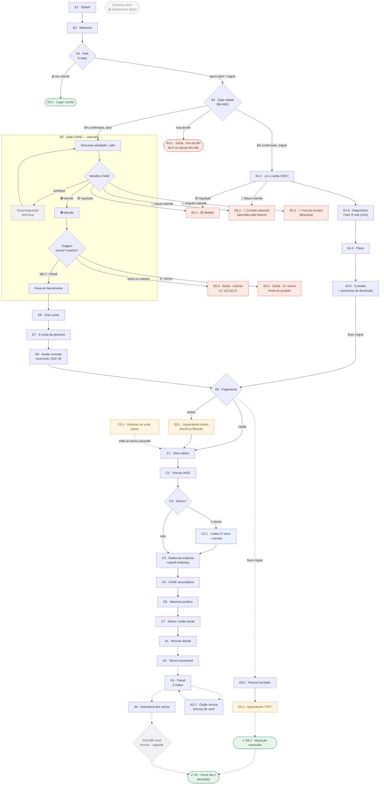

# 🗺️ Mapa vivo do flow

> 🆕 **V2 — pós reunião "Rua Satélite 9" (28/07).** Todas as 12 decisões da reunião cruzadas e travadas no `flow-data.mjs` (`v8`): 3 rotas do N3 confirmadas · gate de cidade novo (BH-MG só) · CNAE mantido (não vira "KINAI") · veredito 🔴 virou 3 vias (Mauro atende / ninguém atende) · front-load de dados em N6 (N10 vira confirmação) · IPTU obrigatório · retry automático de nome (REC) · DAE: cliente paga como já é, sem tela nova (repasse é timing de backend). 3+sócios e sócio-exterior seguem **tentativos** (Pedro disse "estou pensando", não travado). Ver `falta` de cada nó marcado `🆕 28/07` pros detalhes.

> **Nota GERADA. Não editar à mão.** A fonte-única é `flow/flow-data.mjs`; o diagrama, a tabela de validação e o histórico abaixo são re-renderizados por `flow/gerar-mapa.mjs`. Editar aqui é perder o trabalho na próxima geração.
>
> **Como atualizar:** mude `flow/flow-data.mjs` → rode `node execucao/flow/gerar-mapa.mjs`. Ele redesenha tudo, confere o drift contra as rotas reais e, se mudou algo estrutural, grava um snapshot versionado em `flow/versoes/` + uma linha no histórico.
>
> **Legenda:** 🟢 validado/oficial · 🟡 espera gente · ⚪ só UX (revisado) · ✅ construída · 🚧 planejada. No diagrama: vermelho = saída terminal · verde = rota feliz · âmbar = espera · azul = desvio que volta · cinza tracejado = planejado · losango = decisão.
>
> **🆕 28/07 — coluna "Dados coletados nesta etapa"**: nasceu do cruzamento com os dados exigidos pra constituição na JUCEMG (empresa · sócio · endereço). Cada linha diz o que aquela tela pede do cliente **pela primeira vez** — campo repetido ou dado que o sistema já sabe (derivado, sugerido, herdado de tela anterior) não conta de novo. "—" = a tela não coleta nada (recap, decisão do sistema, aceite sem campo, espera, ou saída fora do caminho até a constituição). Verificado linha a linha no código real de cada tela, não inferido pelo nome.

## 🖼️ Diagrama

<!-- FLOW:MAPA:INI -->

<!-- FLOW:MAPA:FIM -->

## ✅ Validação tela por tela

<!-- FLOW:TABELA:INI -->
> ⚠️ **Drift detectado:** rota /avisos existe mas não está no mapa · rota /blog existe mas não está no mapa · rota /blog/post existe mas não está no mapa · rota /componentes existe mas não está no mapa · rota /emitir existe mas não está no mapa · rota /home-a existe mas não está no mapa · rota /home-b existe mas não está no mapa · rota /home-c existe mas não está no mapa · rota /home-campea existe mas não está no mapa · rota /home-d existe mas não está no mapa · rota /home-e existe mas não está no mapa · rota /home-f existe mas não está no mapa · rota /impostos/aliquotas existe mas não está no mapa · rota /impostos/guias existe mas não está no mapa · rota /impostos/pagar existe mas não está no mapa · rota /impostos existe mas não está no mapa · rota /impostos-v1 existe mas não está no mapa · rota /impostos-v2 existe mas não está no mapa · rota /inicio existe mas não está no mapa · rota /inicio-ref11 existe mas não está no mapa · rota /inicio-ref12 existe mas não está no mapa · rota /inicio-ref5 existe mas não está no mapa · rota /inicio-ref6 existe mas não está no mapa · rota /inicio-ref7 existe mas não está no mapa · rota /inicio-ref9 existe mas não está no mapa · rota /mais/certificado existe mas não está no mapa · rota /mais/declaracoes existe mas não está no mapa · rota /mais/documentos existe mas não está no mapa · rota /mais/em-dia existe mas não está no mapa · rota /mais/empresa existe mas não está no mapa · rota /mais existe mas não está no mapa · rota /mais/plano existe mas não está no mapa · rota /mais/relatorios existe mas não está no mapa · rota /mais/servicos existe mas não está no mapa · rota /mais/socios existe mas não está no mapa · rota /mais-completa existe mas não está no mapa · rota /mais-v1 existe mas não está no mapa · rota /notas/detalhe existe mas não está no mapa · rota /notas existe mas não está no mapa · rota /obrigacoes existe mas não está no mapa · rota /perfil existe mas não está no mapa · rota /pro-labore existe mas não está no mapa · rota /conta-v2 existe mas não está no mapa · rota /conta-v2-robusto existe mas não está no mapa · rota /plano-v2 existe mas não está no mapa · rota /plano-v2-robusto existe mas não está no mapa · rota /apresentacao existe mas não está no mapa · rota /mockup-home existe mas não está no mapa · rota /mockup-inicio existe mas não está no mapa · rota /mockup-v2 existe mas não está no mapa

| # | Tela | Dados coletados nesta etapa | Construída | Validado | Falta validar |
|---|---|---|:--:|:--:|---|
| 1 | E1 · Splash | — | ✅ | ⚪ | — |
| 2 | E2 · Welcome | — | ✅ | ⚪ | — |
| 3 | E3 · Fork · 3 rotas | — | ✅ | 🟢 | 3 rotas CONFIRMADAS 28/07 (reunião Rua Satélite 9): abrir · migrar · já sou cliente. |
| 4 | E3.1 · Login / portal | — | ✅ | ⚪ | Rota feliz |
| 5 | E4 · Gate cidade · (BH-MG) | Confirma cidade de abertura = Belo Horizonte/MG (único município atendido no MLP) | ✅ | 🟢 | Construído 28/07 — 2º passo INLINE do E3, mesma rota (/entrada), sem rota própria. |
| 6 | E4.1 · Saída · fora de BH · MLP só atende BH-MG | — (saída, fora do caminho até a constituição) | ✅ | 🟢 | — |
| 7 | E4.2 · Lê o cartão CNPJ | CNPJ (consulta) · confirmação dos dados do cartão | ✅ | 🟢 | Autofill por CNPJ (API pública); sem entrevista de atividade — o CNAE já existe |
| 8 | E4.3 · Diagnóstico · Fator R real (12m) | Folha + receita dos últimos 12 meses (histórico real, não faixa) | ✅ | 🟢 | ⚖️ Guarda-corpo de honestidade (`?cenario=ja-otimo`): se o contador atual já acertou o enquadramento, a tela DIZ isso e vende serviço, não economia inventada. Usa histórico REAL (CGSN 140/18 art.26), não estimativa — dívida `promessa-quebrada` do caminho abrir NÃO se aplica aqui |
| 9 | E4.4 · Plano | — | ✅ | 🟡 | Mesma mensalidade do caminho abrir; sem taxa de governo (empresa já existe) |
| 10 | E4.5 · Contrato · + promessa de devolução | Aceite do contrato (com a cláusula de devolução) | ✅ | 🟢 | 🔴 DECISÃO TRAVADA 30/07: cobra ANTES do TTRT, com contrapartida OBRIGATÓRIA no contrato ('se a transferência não sair por motivo fora do seu controle, devolve tudo'). Se essa linha sair do contrato, a decisão reabre (Mauro/Larissa redigem) |
| 11 | E9.2 · Passivo herdado | — | ✅ | 🟡 | 🕓 Aberto com o Mauro: upsell ou fora de escopo? Variantes `?cenario=limpo` (persona migra-limpo, sem passivo) × com-passivo |
| 12 | E9.3 · Aguardando TTRT | — | ✅ | 🟢 | 🔴 A PAUSA MAIS PERIGOSA DO PRODUTO: quem libera é o CONTADOR ANTIGO (valida no CRC-MG) — único momento em que o dono da espera é um concorrente perdendo o cliente, não um órgão neutro nem o próprio cliente. Nº da resolução CFC / Evento 232 Redesim NÃO ratificados em fonte primária — por isso não aparecem na tela (🟡 pendência) |
| 13 | ✅ E9.4 · Migração concluída | — | ✅ | ⚪ | Segue pro mesmo handoff do caminho abrir → A5 (home dia-1), autoridade #2 (portal-data.mjs) |
| 14 | Descreve atividade + pills | Descrição da atividade (texto livre) → CNAE principal (derivado por IA) · OU o código já sabido (atalho 28/07, mesma engine) | ✅ | 🟡 | ✅ 28/07: CTA 'já sei o número do meu CNAE' construído (troca pra modo código, mesma engine). Lista CNAE furada na raiz: 124 não-refutados, 45 impossíveis, 91 duvidosos; IA real (hoje mock) — Larissa/Pedro/dev |
| 15 | Veredito CNAE | — | ✅ | 🟢 | 🆕 28/07: veredito 🔴 virou 3 vias (travado na reunião), hoje o mock só faz 2 — falta implementar o split: regulamentado→waitlist (já existe) · atendido pelo Mauro (comércio etc)→contato especial · genuinamente ninguém atende→descarta (novo). Depende da lista CNAE; dev cnae-lookup responde 'atende' pra DEFESA. 🆕 31/07: veredito 🟢 ganhou cards clicáveis (UX-65) e travar o CNAE via ENCAIXE virou redundante — ENCAIXE removido, o veredito trava direto |
| 16 | 🟢 Atende | — | ✅ | 🟡 | Depende da lista CNAE |
| 17 | Triagem · sócios? exterior? | Quantidade de sócios (1 / 2 / 3+) · mora fora do Brasil (sim/não) | ✅ | 🟢 | Exterior = LC 123 art.17 (oficial); limite 2 travado. Abertos: debate 3+→waitlist, UX-42 (Mauro/Larissa) |
| 18 | Faixa de faturamento | Faixa de faturamento mensal (ou valor exato, se souber) | ✅ | ⚪ | Faixas sem âncora fiscal |
| 19 | E5.1 · 🟡 Waitlist | Nome + contato · CNAE pretendido (✅ campo construído 28/07) | ✅ | 🟢 | ✅ 28/07: campo CNAE pretendido construído (read-only, junto do nome+contato). Tags de CRM ficam pra depois, não travam. Waitlist decidido 16/07; líder atende regulada (Mauro reavaliar) |
| 20 | E5.2 · 🔴 Contato especial · (atendido pelo Mauro) | — (saída, fora do caminho até a constituição) | ✅ | 🟢 | ✅ 28/07: relabel construído — é quem NÃO atendemos mas a Legalize Digital (Mauro) atende (ex: comércio). Falta só o split real no mapear() do E5 (hoje é mock estático por página). |
| 21 | E5.3 · 🔴 Fora de escopo · (descarta) | — (saída, fora do caminho até a constituição) | ✅ | 🟢 | mapear() do E5 ainda não decide entre E5.2/E5.3 de verdade (mock estático) — falta o split real na IA/lista de CNAEs |
| 22 | E5.4 · Saída · exterior · LC 123 art.17 | — (saída, fora do caminho até a constituição) | ✅ | 🟡 | 🟡 28/07: Pedro cogitou 'de fato descartar' essa saída dedicada (juntar no genérico) — dito na MESMA frase tentativa do E5.5, NÃO travado. Tela já tem conteúdo jurídico revisado (LC123 art.17) — não apagar sem confirmação final. UX-42 Lucro Presumido (Mauro); debate de tom |
| 23 | E5.5 · Saída · 3+ sócios · limite do produto | — (saída, fora do caminho até a constituição) | ✅ | 🟡 | 🟡 28/07: Pedro cogitou juntar essa saída com a Waitlist (regulamentados) — 'estou pensando', NÃO travado. Debate 3+→waitlist |
| 24 | E6 · Criar conta | E-mail · senha · 'é a 1ª empresa que abre?' (opcional) · nome completo · CPF · telefone · endereço (front-load 28/07) · código de verificação (mock) | ✅ | 🟢 | ✅ 28/07: FRONT-LOAD construído — nome/CPF/telefone/endereço (autofill CEP) + etapa de validação por código (mock). Provider de validação CPF/situação real (Pedro) |
| 25 | E7 · A conta da abertura | — | ✅ | 🟡 | Preço ~R$195 FAKE (Mauro+custo); DAE R$268,51×R$288 em disputa; certificado A1 (Mauro) |
| 26 | E8 · Aceite contrato · reversível, CDC 49 | Aceite do contrato de serviço (checkbox) | ✅ | 🟡 | Redação jurídica do contrato (Mauro/Larissa); rachadura T18 |
| 27 | E9 · Pagamento | CPF (cobrança + elegibilidade) · método de pagamento (cartão/Pix/boleto) | ✅ | 🟡 | Asaas travado; falta provider cartão CNPJ + chave de idempotência (Pedro) |
| 28 | E9.1 · Aguardando boleto · dossiê já liberado | — | ✅ | ⚪ | Dunning revisado |
| 29 | C1 · Seus dados | CONFIRMA nome/CPF/endereço já captados no E6 (não recoleta) · RG + órgão emissor (novo aqui) · estado civil (+ regime de bens se casado) · confirma se mora fora do Brasil | ✅ | 🟢 | ✅ 28/07: reconstruída como CONFIRMAÇÃO — card read-only do que veio do E6 (mock, sem estado real compartilhado ainda) + só pede o que faltou. CPF valida situação (provider do E6); regime de bens (casado) |
| 30 | C2 · Vínculo INSS | Já contribui INSS por fora? (sim/não) · valor do vínculo (CLT/aposentadoria/autônomo/sócio de outro CNPJ) | ✅ | 🟢 | INSS 11% direto + teto folga = consolidado fiscal fechado |
| 31 | C3 · Sócios? | Confirma se terá 2º sócio | ✅ | 🟡 | Re-pergunta o E5T (carry-forward pendente); limite 2 ok |
| 32 | C3.1 · Coleta 2º sócio · + convite | Nome completo do 2º sócio · % de participação de cada um (soma 100%) | ✅ | 🟡 | Convite depende do A3 planejado |
| 33 | C4 · Dados da empresa · +upsell endereço | Endereço próprio ou fiscal Legalizai · CEP (autofill logradouro/bairro/município/UF) + número + complemento · índice cadastral IPTU (OBRIGATÓRIO, JUCEMG exige) · tipo de endereço · residência de sócio (dinâmico pelo E5T — pula se solo) · capital social | ✅ | 🟢 | ✅ 28/07: IPTU corrigido pra OBRIGATÓRIO travado (JUCEMG exige). Capital social mantém input livre por ora (faixas sugeridas aguardam validação com mais técnicos contábeis). Endereço ~R$60/mês = nosso preço (Mauro); custo do líder já confirmado |
| 34 | C5 · CNAE secundários | CNAEs secundários (seleção múltipla, opcional) | ✅ | 🟡 | Só sugere secundárias mesmo-imposto (mesmo anexo + Fator R); regime-changer nunca aparece (decisão 21/07). Depende do anexo-por-CNAE (dataset/Larissa) |
| 35 | C6 · Natureza jurídica | Escolha da natureza jurídica (SLU ou LTDA — sugerida, editável) | ✅ | 🟡 | SLU × LTDA: regra solo→SLU vs LTDA solo real (Larissa) |
| 36 | C7 · Nome / razão social | 3 opções de razão social por ordem de prioridade (sugeridas por IA) · objeto social (sugerido por CNAE+secundárias, editável) · nome fantasia (opcional) | ✅ | 🟡 | Viabilidade JUCEMG (RPA, não API); nome≠empresa (dev/Izabela); 3 opções por prioridade (28/07) |
| 37 | C0.1 · Retomar de onde parou | — | ✅ | ⚪ | UX-23 fechado — mora em /pro-labore pós-constituição |
| 38 | A1 · Revisar dossiê | — (leitura + confirmação; enquadramento e pró-labore são SUGERIDOS pelo sistema, 28/07 — não digitados) | ✅ | ⚪ | Recap read-only; carry-forward dos passos = estado do wizard (dev) |
| 39 | A2 · Termo irreversível | Aceite do termo irreversível (checkbox) | ✅ | 🟡 | Redação jurídica do termo + 4 camadas de cancelamento (Mauro/Larissa); racha T18 |
| 40 | A3 · Painel · 3 status | — | ✅ | 🟢 | 🆕 30/07: reduzido de 9→3 status (2 passadas). 'Registrar a empresa'→'Analisando viabilidade'; novo 'Documentação completa preenchida' (check, acima) + 'Agora é só assinar' (cinza, depende do deferimento da Junta). 🆕 28/07: DAE (taxa da Junta) — cliente paga no E9 junto com a mensalidade; a gente SEGURA e só repassa à JUCEMG depois da viabilidade aprovar — timing de backend, SEM tela nova. 🆕 30/07: NÃO absorvemos a taxa (alinhado ao líder, contrato Contabilizei 4.3"h"). Timeline real depende do pipeline do dev; prazo ~8d é placeholder |
| 41 | A3.1 · Órgão recusa · 'precisa de você' | Retry automático pelas 3 opções priorizadas (C7) antes de pedir novas sugestões ao cliente | ✅ | 🟢 | ✅ 28/07: retry automático construído — tenta as 3 opções do C7 em sequência (mock sempre falha as 3, pra provar o pior caso); só aí pede novas sugestões. Testado no motor (nome recusado); faltam DAE-volta e doc-pendência como casos |
| 42 | A4 · Assinatura dos sócios | Assinatura via GOV.BR/e-CAC (ação, não campo de texto) | ✅ | 🟡 | GOV.BR/e-CAC deep-link (dev); convite 2º sócio + arquitetura multi-usuário (Pedro) |
| 43 | 'Empresa ativa' · 🗑️ REMOVIDO 30/07 | — | 🚧 | 🟢 | Era órfão desde o swap A4→A5 (nenhuma rota navegava mais até aqui) — arquivo `/ativa` e a view apagados de vez 30/07, confirmado pelo Pedro. Fica só como marca histórica no mapa |
| 44 | ✅ A5 · Home dia-1 · (ativação) | — | ✅ | 🟢 | 🔓 SWAP validado 30/07 (confirmado no código: assinatura empurra direto pra cá). Trata o certificado como item 2/3 da própria trilha, não gate isolado. Sem confete nem selo coral no hero. Handoff pro flow Portal (letra P) → autoridade portal-data.mjs |
<!-- FLOW:TABELA:FIM -->

## 🚪 Saídas terminais (7) — sai do flow, não volta
> 🆕 28/07 (reunião Rua Satélite 9): eram 5, agora são 7 — o veredito 🔴 virou 3 vias (era 2) e o gate de cidade criou uma saída nova.
1. **Login** (N3, "já sou cliente") — rota feliz.
2. **🆕 Saída · fora de BH** (N3G, gate de cidade) — MLP só atende Belo Horizonte/MG. Planejada, zero linha de código ainda.
3. **🟡 Waitlist** (N4 veredito, CNAE regulamentado) — capta nome+contato+**CNAE pretendido** (campo novo 28/07), não fecha porta.
4. **🔴 Contato especial** (N4 veredito, atendido pelo Mauro — ex: comércio) — renomeado 28/07, era "Comercial Mauro".
5. **🆕 🔴 Fora de escopo / descarta** (N4 veredito, ninguém atende — nem a gente, nem regulamentado, nem o Mauro) — 3ª via nova do veredito, decisão explícita de descartar, não omissão. Planejada.
6. **🟡 Sócio no exterior** (N4 triagem) — barra ANTES do dinheiro. Pedro cogitou descartar essa saída dedicada (28/07), **não travado**.
7. **🟡 3+ sócios** (N4 triagem) — barra ANTES do dinheiro. Pedro cogitou juntar com a Waitlist (28/07), **não travado**.

## 🔄 Desvios que voltam ao tronco
- **Desambiguação** (N4, CNAE ambíguo) → volta pro N4.
- **Boleto** (N9) → P2 aguardando → dossiê segue; a cauda (N17+) trava até compensar.
- **2 sócios** (N12) → coleta 2º + convite → volta ao tronco.
- **Retomar** (P1) → volta ao passo pausado (qualquer pausa).
- **Órgão recusa** (N21, planejado) → "precisa de você" → recupera. 🆕 28/07: retry AUTOMÁTICO pelas 3 opções de nome (N16) antes de pedir ajuda ao cliente.
- **GOV.BR bronze** (N23, planejado) → upgrade → segue.

## ⚠️ Notas de fidelidade
- O losango **N12 "Sócios?"** re-pergunta o que o **N4 triagem** já sabe (dívida `N12 re-pergunta o que o N4 já sabe`). O mapa desenha a realidade atual, não o fix. ⚠️ Continua valendo mesmo com o front-load do N6 (28/07) — são dívidas diferentes: N12 re-pergunta CONTAGEM de sócios (N4), N10 re-perguntava DADOS pessoais (N6, essa foi resolvida — N10 virou confirmação).
- **N19–N25 e o flow #2 não têm rota** — a ordem da cauda é a intenção de [[mapa-ramificacoes-flow]], pode mudar ao construir.
- Numerações antigas **T1–T23** aparecem em ~8 docs; a tradução T→N vive no [[indice-autoridade]].
- 🆕 **28/07 — DAE (taxa da Junta): decisão travada.** Cliente paga no N9 (junto com a mensalidade, como já é hoje) — **não muda**. A Legalizai segura esse valor e só repassa a JUCEMG depois que a viabilidade (N21) aprova — é timing de **backend**, invisível pro cliente, **sem tela nova**. O cenário alternativo ("empresa paga o DAE, cliente nunca vê essa cobrança") fica **documentado como opção pra depois**, não implementado: nesse cenário, N7 perde a linha de taxa, N9 cobra só mensalidade, o card de "Taxa da Junta" some do N19, e o argumento de irreversibilidade do N20 precisa trocar de base (hoje é "a taxa não volta"). Decisão de preço/margem, não de UX — aguarda Mauro.
- 🆕 **28/07 — front-load de dados pessoais (N6).** Nome/CPF/telefone/endereço migram pro N6 (criar conta), com validação obrigatória por e-mail/SMS. **N10 deixa de coletar do zero — vira tela de confirmação** do que já veio do N6, só pedindo o que faltou (RG, órgão emissor, estado civil, regime de bens). Nenhum dos dois foi reconstruído no código ainda — é decisão travada, implementação pendente.
- 🆕 **28/07 — veredito 🔴 tem 3 saídas, mock só implementa 2.** O `mapear()` mock (N4) hoje só distingue atende/regulamentado/comércio. Falta separar "atendido pelo Mauro" (VC) de "ninguém atende, descarta" (VD, nó novo) — mesma lista fixa de CNAEs atendidos decide os 2, só a consequência muda.

## 📜 Histórico de versões (commit interno)
> Cada linha = um estado estrutural do mapa. Snapshots completos em `flow/versoes/` (`.json` p/ diff + `.mmd` legível). Mais recente no topo.

<!-- FLOW:VERSOES:INI -->
- **v13** · 2026-08-03 · +nós E1,E2,E3,E3_1,E4,E4_1,E4_2,E4_3,E4_4,E4_5,E9_2,E9_3,E9_4,E5A,E5V,E5VA,E5T,E5F,E5_1,E5_2,E5_3,E5_4,E5_5,E6,E7,E8,E9,E9_1,C1,C2,C3,C3_1,C4,C5,C6,C7,C0_1,A1,A2,A3,A3_1,A4,A4G,REMOVIDO_N24,A5 · -nós N1,N2,N3,LOGIN,N3G,SAIDACID,M1,M2,M3,M3B,M4,M5,M6,N4A,N4V,N4T,N4F,VA,VW,VC,VD,N6,N7,N8,N9,P2,N10,N11,N12,N12B,N13,N14,N15,N16,P1,SE,SS,N19,N20,N21,REC,N22,N23,ATIVA,P0 · +conexões E1→E2,E2→E3,E3→E3_1,E3→E4,E4→E5A,E4→E4_2,E4→E4_1,E4_2→E4_3,E4_2→E5_1,E4_2→E5_2,E4_3→E4_4,E4_4→E4_5,E4_5→E9,E9→E9_2,E9_2→E9_3,E9_3→E9_4,E9_4→A5,E5A→E5V,E5V→DESAMB,DESAMB→E5A,E5V→E5VA,E5VA→E5T,E5V→E5_1,E5V→E5_2,E5V→E5_3,E5T→E5F,E5T→E5_4,E5T→E5_5,E5F→E6,E6→E7,E7→E8,E8→E9,E9→C1,E9→E9_1,E9_1→C1,C1→C2,C2→C3,C3→C3_1,C3_1→C4,C3→C4,C4→C5,C5→C6,C6→C7,C7→A1,A1→A2,A2→A3,A3→A3_1,A3_1→A3,A3→A4,A4→A4G,A4G→A5,C0_1→C1 · -conexões N1→N2,N2→N3,N3→LOGIN,N3→N3G,N3G→N4A,N3G→M1,N3G→SAIDACID,M1→M2,M1→VW,M1→VC,M2→M3,M3→M3B,M3B→N9,N9→M4,M4→M5,M5→M6,M6→P0,N4A→N4V,N4V→DESAMB,DESAMB→N4A,N4V→VA,VA→N4T,N4V→VW,N4V→VC,N4V→VD,N4T→N4F,N4T→SE,N4T→SS,N4F→N6,N6→N7,N7→N8,N8→N9,N9→N10,N9→P2,P2→N10,N10→N11,N11→N12,N12→N12B,N12B→N13,N12→N13,N13→N14,N14→N15,N15→N16,N16→N19,N19→N20,N20→N21,N21→REC,REC→N21,N21→N22,N22→N23,N23→P0,P1→N10
- **v12** · 2026-07-31 · -nós ENC · falta-validar em N4V · +conexões VA→N4T · -conexões VA→ENC,ENC→N4T
- **v11** · 2026-07-30 · renomeou ATIVA "N24 · Empresa ativa ⚠️ ÓRFÃO"→"N24 · Empresa ativa 🗑️ REMOVIDO 30/07" · status ATIVA construida→planejada · validação ATIVA pendente→oficial · falta-validar em ATIVA
- **v10** · 2026-07-30 · +nós M1,M2,M3,M3B,M4,M5,M6,P0 · -nós MIG · renomeou N21 "N21 · Painel / timeline órgãos"→"N21 · Painel 3 status"; ATIVA "✅ Empresa ativa"→"N24 · Empresa ativa ⚠️ ÓRFÃO" · validação ATIVA oficial→pendente · falta-validar em N3,N21,ATIVA · +conexões N3G→M1,M1→M2,M1→VW,M1→VC,M2→M3,M3→M3B,M3B→N9,N9→M4,M4→M5,M5→M6,M6→P0,N23→P0 · -conexões N3G→MIG,N23→ATIVA
- **v9** · 2026-07-28 · status N3G planejada→construida; SAIDACID planejada→construida; VD planejada→construida · falta-validar em N3G,SAIDACID,N4A,VW,VC,VD,N6,N10,N13,REC · dados-coletados em N4A,VW,N6,N10,N13,REC
- **v8** · 2026-07-28 · +nós N3G,SAIDACID,VD · renomeou VC "🔴 Comercial Mauro"→"🔴 Contato especial (atendido pelo Mauro)" · validação N3 pendente→oficial; N4V pendente→oficial; VC pendente→oficial; N6 pendente→oficial; N10 pendente→oficial; N13 pendente→oficial; SE oficial→pendente; SS oficial→pendente; N21 pendente→oficial; REC ux→oficial; ATIVA pendente→oficial · falta-validar em N3,N4A,N4V,VW,VC,N6,N10,N13,SE,SS,N21,REC,ATIVA · dados-coletados em N4A,VW,N6,N10,N13,REC · +conexões N3→N3G,N3G→N4A,N3G→MIG,N3G→SAIDACID,N4V→VD · -conexões N3→N4A,N3→MIG
- **v7** · 2026-07-28 · dados-coletados preenchido em 23 nós
- **v6** · 2026-07-28 · -nós N18 · falta-validar em N16,P1 · +conexões N16→N19 · -conexões N16→N18,N18→N19
- **v5** · 2026-07-28 · -nós N5 · +conexões N4F→N6 · -conexões N4F→N5,N5→N6
- **v4** · 2026-07-21 · +nós ENC · -nós SWAP,N17 · renomeou N5 "N5 · Teaser swap / fator-R / serviço"→"N5' · Resumo de valor faixa-based, suave" · validação N5 pendente→ux · falta-validar em N5 · +conexões VA→ENC,ENC→N4T,N16→N18 · -conexões VA→N4T,N16→SWAP,SWAP→N17,N17→N18,SWAP→N18
- **v3** · 2026-07-21 · renomeou REC "Órgão recusa 'precisa de você'"→"REC · Órgão recusa 'precisa de você'"; N23 "N23 · GOV.BR bronze → upgrade"→"GOV.BR nível bronze→upgrade" · status N19 planejada→construida; N20 planejada→construida; N21 planejada→construida; REC planejada→construida; N22 planejada→construida; N23 planejada→construida; ATIVA planejada→construida · validação N19 pendente→ux; REC pendente→ux; ATIVA oficial→pendente · falta-validar em N19,N20,N21,REC,N22,N23,ATIVA
- **v2** · 2026-07-21 · falta-validar em N14
- **v1** · 2026-07-21 · versão inicial (40 nós, 44 conexões)
(o gerador preenche aqui)
<!-- FLOW:VERSOES:FIM -->

## Links
[[mapa-ramificacoes-flow]] (lógica A/B/C) · [[mapa-telas-mobile]] (inventário) · [[design-system]] (arquétipos A1–A10) · [[legalize-telas-padrao-layout]] · [[fila-validacao-humana]] · [[HOME]]
