# 🗺️ Mapa vivo do flow

> **Nota GERADA. Não editar à mão.** A fonte-única é `flow/flow-data.mjs`; o diagrama, a tabela de validação e o histórico abaixo são re-renderizados por `flow/gerar-mapa.mjs`. Editar aqui é perder o trabalho na próxima geração.
>
> **Como atualizar:** mude `flow/flow-data.mjs` → rode `node execucao/flow/gerar-mapa.mjs`. Ele redesenha tudo, confere o drift contra as rotas reais e, se mudou algo estrutural, grava um snapshot versionado em `flow/versoes/` + uma linha no histórico.
>
> **Legenda:** 🟢 validado/oficial · 🟡 espera gente · ⚪ só UX (revisado) · ✅ construída · 🚧 planejada. No diagrama: vermelho = saída terminal · verde = rota feliz · âmbar = espera · azul = desvio que volta · cinza tracejado = planejado · losango = decisão.

## 🖼️ Diagrama

```mermaid
flowchart TD
  subgraph GATE["N4 · Gate-CNAE — uma tela"]
    direction TB
    N4A["Descreve atividade + pills"]
    N4V{"Veredito CNAE"}
    DESAMB["Desambiguação<br/>mini-loop"]:::inline
    N4T{"Triagem<br/>sócios? exterior?"}
    N4F["Faixa de faturamento"]
  end
  N1["N1 · Splash"]
  N2["N2 · Welcome"]
  N3{"N3 · Fork<br/>3 rotas"}
  LOGIN(["Login / portal"]):::feliz
  MIG["Flow #2 · Migração<br/>não construído"]:::todo
  VA["🟢 Atende"]
  VW["🟡 Waitlist"]:::saida
  VC["🔴 Comercial Mauro"]:::saida
  N5{"N5 · Teaser<br/>swap / fator-R / serviço"}
  N6["N6 · Criar conta"]
  N7["N7 · A conta da abertura"]
  N8["N8 · Aceite contrato<br/>reversível, CDC 49"]
  N9{"N9 · Pagamento"}
  P2["P2 · Aguardando boleto<br/>dossiê já liberado"]:::espera
  N10["N10 · Seus dados"]
  N11["N11 · Vínculo INSS"]
  N12{"N12 · Sócios?"}
  N12B["Coleta 2º sócio<br/>+ convite"]:::branch
  N13["N13 · Dados da empresa<br/>+upsell endereço"]
  N14["N14 · CNAE secundários"]
  N15["N15 · Natureza jurídica"]
  N16["N16 · Nome / razão social"]
  SWAP{"há família<br/>de swap?"}
  N17["N17 · CNAE ótimo"]
  N18["N18 · Simulador pró-labore"]
  P1["P1 · Retomar de onde parou"]:::espera
  SE["Saída · exterior<br/>LC 123 art.17"]:::saida
  SS["Saída · 3+ sócios<br/>limite do produto"]:::saida
  N19["N19 · Revisar dossiê"]:::todo
  N20["N20 · Termo irreversível"]:::todo
  N21["N21 · Painel / timeline órgãos"]:::todo
  REC["Órgão recusa<br/>'precisa de você'"]:::todo
  N22["N22 · Assinatura dos sócios"]:::todo
  N23{"N23 · GOV.BR<br/>bronze → upgrade"}:::todo
  ATIVA(["✅ Empresa ativa"]):::feliz

  N1 --> N2
  N2 --> N3
  N3 -->|"já sou cliente"| LOGIN
  N3 -->|"quero abrir empresa"| N4A
  N3 -.->|"já tenho contador (migrar)"| MIG
  N4A --> N4V
  N4V -->|"ambíguo"| DESAMB
  DESAMB --> N4A
  N4V -->|"🟢 atende"| VA
  VA --> N4T
  N4V -->|"🟡 regulada"| VW
  N4V -->|"🔴 comércio"| VC
  N4T -->|"até 2 + Brasil"| N4F
  N4T -->|"sócio no exterior"| SE
  N4T -->|"3+ sócios"| SS
  N4F --> N5
  N5 --> N6
  N6 --> N7
  N7 --> N8
  N8 --> N9
  N9 -->|"cartão"| N10
  N9 -->|"boleto"| P2
  P2 --> N10
  N10 --> N11
  N11 --> N12
  N12 -->|"2 sócios"| N12B
  N12B --> N13
  N12 -->|"solo"| N13
  N13 --> N14
  N14 --> N15
  N15 --> N16
  N16 --> SWAP
  SWAP -->|"sim"| N17
  N17 --> N18
  SWAP -->|"não"| N18
  N18 -.-> N19
  N19 -.-> N20
  N20 -.-> N21
  N21 -.-> REC
  REC -.-> N21
  N21 -.-> N22
  N22 -.-> N23
  N23 -.-> ATIVA
  P1 -.->|"volta ao passo pausado"| N10

  classDef saida fill:#fde8e4,stroke:#e0603f,color:#7a2d18;
  classDef feliz fill:#e6f4ea,stroke:#2f9e5a,color:#1c5e37;
  classDef espera fill:#fff4e0,stroke:#e0a03f,color:#7a5518;
  classDef branch fill:#eef1ff,stroke:#5b6cf0,color:#2a338a;
  classDef inline fill:#f1f1f3,stroke:#9aa0a6,color:#555;
  classDef todo fill:#f7f7f8,stroke:#bcbcc2,stroke-dasharray:5 4,color:#888;
```

<!-- FLOW:MAPA:INI -->

<!-- FLOW:MAPA:FIM -->

## ✅ Validação tela por tela

<!-- FLOW:TABELA:INI -->
| # | Tela | Construída | Validado | Falta validar |
|---|---|:--:|:--:|---|
| 1 | N1 · Splash | ✅ | ⚪ | — |
| 2 | N2 · Welcome | ✅ | ⚪ | — |
| 3 | N3 · Fork · 3 rotas | ✅ | 🟡 | Rota migrar aponta pro flow #2 (não existe): cobrar antes do TTRT? passivo herdado? (Pedro/Mauro) |
| 4 | Login / portal | ✅ | ⚪ | Rota feliz |
| 5 | Flow #2 · Migração · não construído | 🚧 | 🟡 | Construir flow #2 |
| 6 | Descreve atividade + pills | ✅ | 🟡 | Lista CNAE furada na raiz: 124 não-refutados, 45 impossíveis, 91 duvidosos; IA real (hoje mock) — Larissa/Pedro/dev |
| 7 | Veredito CNAE | ✅ | 🟡 | Depende da lista CNAE; dev cnae-lookup responde 'atende' pra DEFESA |
| 8 | Triagem · sócios? exterior? | ✅ | 🟢 | Exterior = LC 123 art.17 (oficial); limite 2 travado. Abertos: debate 3+→waitlist, UX-42 (Mauro/Larissa) |
| 9 | Faixa de faturamento | ✅ | ⚪ | Faixas sem âncora fiscal |
| 10 | 🟢 Atende | ✅ | 🟡 | Depende da lista CNAE |
| 11 | 🟡 Waitlist | ✅ | 🟢 | Waitlist decidido 16/07; líder atende regulada (Mauro reavaliar) |
| 12 | 🔴 Comercial Mauro | ✅ | 🟡 | Mauro recebe/trabalha o lead? (debate de saída) |
| 13 | N5 · Teaser · swap / fator-R / serviço | ✅ | 🟡 | TEASER_PISO=0.5 é chute (só modo swap) — Pedro. Fator-R/serviço derivam de lib/fiscal |
| 14 | N6 · Criar conta | ✅ | 🟡 | Provider de validação CPF/situação (Pedro) |
| 15 | N7 · A conta da abertura | ✅ | 🟡 | Preço ~R$195 FAKE (Mauro+custo); DAE R$268,51×R$288 em disputa; certificado A1 (Mauro) |
| 16 | N8 · Aceite contrato · reversível, CDC 49 | ✅ | 🟡 | Redação jurídica do contrato (Mauro/Larissa); rachadura T18 |
| 17 | N9 · Pagamento | ✅ | 🟡 | Asaas travado; falta provider cartão CNPJ + chave de idempotência (Pedro) |
| 18 | P2 · Aguardando boleto · dossiê já liberado | ✅ | ⚪ | Dunning revisado |
| 19 | N10 · Seus dados | ✅ | 🟡 | CPF valida situação (provider do N6); regime de bens (casado) |
| 20 | N11 · Vínculo INSS | ✅ | 🟢 | INSS 11% direto + teto folga = consolidado fiscal fechado |
| 21 | N12 · Sócios? | ✅ | 🟡 | Re-pergunta o N4 (carry-forward pendente); limite 2 ok |
| 22 | Coleta 2º sócio · + convite | ✅ | 🟡 | Convite (B5) depende do N21 planejado |
| 23 | N13 · Dados da empresa · +upsell endereço | ✅ | 🟡 | Endereço ~R$60/mês = nosso preço (Mauro); custo do líder já confirmado |
| 24 | N14 · CNAE secundários | ✅ | 🟡 | Só sugere secundárias mesmo-imposto (mesmo anexo + Fator R); regime-changer nunca aparece (decisão 21/07). Depende do anexo-por-CNAE (dataset/Larissa) |
| 25 | N15 · Natureza jurídica | ✅ | 🟡 | SLU × LTDA: regra solo→SLU vs LTDA solo real (Larissa) |
| 26 | N16 · Nome / razão social | ✅ | 🟡 | Viabilidade JUCEMG (RPA, não API); nome≠empresa (dev/Izabela) |
| 27 | N17 · CNAE ótimo | ✅ | 🟡 | 3 famílias de swap OK; tráfego pago/white-label menor confiança (Larissa) |
| 28 | N18 · Simulador pró-labore | ✅ | 🟡 | 7 pontos fiscais (Larissa); alerta FS12 (COSIT 17/2021) não exibir até conferir |
| 29 | P1 · Retomar de onde parou | ✅ | ⚪ | UX-23 dá pra fechar (N18 existe) |
| 30 | Saída · exterior · LC 123 art.17 | ✅ | 🟢 | UX-42 Lucro Presumido (Mauro); debate de tom |
| 31 | Saída · 3+ sócios · limite do produto | ✅ | 🟢 | Debate 3+→waitlist |
| 32 | N19 · Revisar dossiê | 🚧 | 🟡 | Construir |
| 33 | N20 · Termo irreversível | 🚧 | 🟡 | Construir + cancelamento camada 2 + rachadura T18 (Larissa/Mauro) |
| 34 | N21 · Painel / timeline órgãos | 🚧 | 🟡 | Construir (recebe UX-29 do N6 + gancho por modo/CRM) |
| 35 | Órgão recusa · 'precisa de você' | 🚧 | 🟡 | Construir (B6 testado no motor) |
| 36 | N22 · Assinatura dos sócios | 🚧 | 🟡 | Construir + convite 2º sócio (B5) |
| 37 | N23 · GOV.BR · bronze → upgrade | 🚧 | 🟡 | Construir (B7 testado no motor) |
| 38 | ✅ Empresa ativa | 🚧 | 🟢 | Construir dia-2 (N24-25). TFLF BH R$161,36 = fato duro |
<!-- FLOW:TABELA:FIM -->

## 🚪 Saídas terminais (5) — sai do flow, não volta
1. **Login** (N3, "já sou cliente") — rota feliz.
2. **🟡 Waitlist** (N4 veredito, CNAE regulada) — capta, não fecha porta.
3. **🔴 Comercial Mauro** (N4 veredito, comércio/impeditivo).
4. **Sócio no exterior** (N4 triagem) — barra ANTES do dinheiro.
5. **3+ sócios** (N4 triagem) — barra ANTES do dinheiro.

## 🔄 Desvios que voltam ao tronco
- **Desambiguação** (N4, CNAE ambíguo) → volta pro N4.
- **Boleto** (N9) → P2 aguardando → dossiê segue; a cauda (N17+) trava até compensar.
- **2 sócios** (N12) → coleta 2º + convite → volta ao tronco.
- **Retomar** (P1) → volta ao passo pausado (qualquer pausa).
- **Órgão recusa** (N21, planejado) → "precisa de você" → recupera.
- **GOV.BR bronze** (N23, planejado) → upgrade → segue.

## ⚠️ Notas de fidelidade
- O losango **N12 "Sócios?"** re-pergunta o que o **N4 triagem** já sabe (dívida `N12 re-pergunta o que o N4 já sabe`). O mapa desenha a realidade atual, não o fix.
- **N19–N25 e o flow #2 não têm rota** — a ordem da cauda é a intenção de [[mapa-ramificacoes-flow]], pode mudar ao construir.
- Numerações antigas **T1–T23** aparecem em ~8 docs; a tradução T→N vive no [[indice-autoridade]].

## 📜 Histórico de versões (commit interno)
> Cada linha = um estado estrutural do mapa. Snapshots completos em `flow/versoes/` (`.json` p/ diff + `.mmd` legível). Mais recente no topo.

<!-- FLOW:VERSOES:INI -->
- **v2** · 2026-07-21 · falta-validar em N14
- **v1** · 2026-07-21 · versão inicial (40 nós, 44 conexões)
(o gerador preenche aqui)
<!-- FLOW:VERSOES:FIM -->

## Links
[[mapa-ramificacoes-flow]] (lógica A/B/C) · [[mapa-telas-mobile]] (inventário) · [[design-system]] (arquétipos A1–A10) · [[legalize-telas-padrao-layout]] · [[fila-validacao-humana]] · [[HOME]]
