# 🗺️ Mapa mental — export do CTA "/mockup"

> **Nota GERADA a partir de código.** Fonte-única: `app/src/app/mockup/page.tsx`, constantes `GRUPOS` (colunas/telas) + `MAPA_EDGES` (conexões), linhas ~113–672. É o mesmo dado que o botão "🗺️ Ver mapa mental" renderiza dentro do app — aqui só em `.md`/mermaid pra ler fora do navegador.
>
> ⚠️ **Herança manual** (aviso já no código-fonte, 03/08): `MAPA_EDGES` é tradução manual das arestas reais de `flow/flow-data.mjs` + `portal/portal-data.mjs` (que usam `id`, não `rota`). Se o flow mudar, `MAPA_EDGES` pode ficar defasado até alguém atualizar as duas listas juntas — **não tratar como fonte de verdade do fluxo**, só como visão panorâmica. Fonte de verdade do flow E1–A5 é [[legalize-mapa-flow-vivo|mapa-flow-mermaid.md]] (gerado de `flow-data.mjs`); do Portal é `mapa-portal-mermaid.md`.
>
> **🆕 04/08** — 2 telas novas em `/migrar/cnpj`: [[cruzamento-gemini-fluxo-migracao]] achou 2 gaps reais (regime de origem não checado + CNPJ inapto sem rota) e viraram `/saida/regime-nao-suportado` + `/saida/cnpj-inapto` (demo via `?cenario=mei|presumido|inapto`). `/migrar/transferencia` também mudou: pipeline de 4 → 5 etapas (troca de responsável na Prefeitura separada da atualização Redesim). `/dossie/empresa` (IPTU) e `/mais/documentos` (Alvará + Termo Simples + variante Migrar) só mudaram por dentro, sem tela/rota nova — ver [[cruzamento-gemini-fluxo-abertura]].
>
> **🆕 04/08 (2ª rodada)** — decisão do Pedro: **MEI agora migra normalmente**, só Lucro Presumido segue em `/saida/regime-nao-suportado`. `/migrar/diagnostico?regime=mei` troca o diagnóstico de Fator R pelo subfluxo "você tem contador hoje?" (MEI não é obrigado a ter um); a resposta decide se o M4 (auditoria+TTRT) roda ou se pula direto pro M5. `/migrar/contrato` e `/migrar/ativa` também ganharam variantes MEI. Reabre e resolve pela metade [[legalize-escopo-mei-lucro-presumido-aberto]] — MEI sai da pendência, Lucro Presumido segue aberto (precisa de pesquisa fiscal dedicada antes de virar tela).
>
> **🆕 04/08 (3ª rodada) — Plano MEI travado.** Não é o plano ME com desconto: preço próprio (R$49,90/mês 🔴 FAKE, ponto de partida), fidelidade de 12 meses (contrapartida do certificado digital que a gente paga e precisa pra movimentar a empresa), escopo LIMITADO (emitir NF + gerenciar 1 colaborador, o teto legal do MEI). Descartada a ideia de servir quem nunca assina (avulso pra não-cliente) — mensalidade SEMPRE vem antes, avulso é upsell depois, igual ao plano ME. Nova tela `/mais/colaborador`; `/inicio`, `/mais` e o nav do portal ganharam variante reduzida via `?regime=mei`. Ver ADR em `marca/decisoes-marca.md` (2026-08-04).
>
> **🆕 04/08 (correção)** — a 1ª extração da E4.2 (pedido do Pedro de dividir a tela em 2) tirou a peça errada (loading). Corrigido: a tela extraída é `MigrarAchouView` ("Achamos sua empresa" — card+checagens+veredito), não o spinner.
>
> **🆕 04/08 (4ª rodada) — E3.2 reusada pro Migrar.** Decisão do Pedro: inverter a ordem que existia (perguntava cidade ANTES de saber MEI×ME). Agora Migrar ("Já tenho empresa") também passa pela E3.2 — mesma tela (`MeiOuMeView`), `contexto="migrar"` troca a copy de "qual devo escolher" (elegibilidade, faz sentido pra quem vai abrir) pra "qual eu já sou" (autodeclaração, o CNPJ já existe). MEI pula a cidade e vai direto pro M1 (`/migrar/cnpj?cenario=mei`); ME cai no mesmo gate de cidade de sempre. Autodeclarado, não trava — quem confirma de verdade é o M1, puxando da Receita.
>
> **Legenda:** seta cheia = fluxo principal · seta tracejada = ramo/alternativa/atalho (mais fino, menos frequente que o principal).

## 🖼️ Diagrama

```mermaid
flowchart LR

  subgraph G1["E1–E4 · Entrada (Migrar fundido no fork)"]
    direction TB
    n_splash["E1 · Splash<br/>/splash"]
    n_welcome["E2 · Welcome<br/>/welcome"]
    n_entrada["E3 · Fork de 3 rotas<br/>/entrada"]
    n_entrada_abrir["E3.2 · MEI × ME (Abrir)<br/>/entrada?intencao=abrir"]
    n_entrada_migrar["🆕 E3.2 · MEI × ME (Migrar)<br/>/entrada?intencao=migrar"]
    n_entrada_abrir_me["E4 · Gate de cidade (BH-MG)<br/>/entrada?intencao=abrir&amp;regime=me"]
    n_saida_fora_bh["E4.1 · Saída · fora de BH<br/>/saida/fora-bh"]
    n_migrar_cnpj["E4.2 · Migrar · Seu CNPJ<br/>/migrar/cnpj"]
    n_migrar_achou["🆕 E4.2 · Achamos sua empresa<br/>/migrar/cnpj?fase=achou"]
    n_saida_regime["🆕 Saída · Regime não suportado (Presumido)<br/>/saida/regime-nao-suportado"]
    n_saida_cnpj_inapto["🆕 Saída · CNPJ inapto/suspenso<br/>/saida/cnpj-inapto"]
    n_migrar_diag_mei["🆕 E4.3 · Diagnóstico MEI (tem contador?)<br/>/migrar/diagnostico?regime=mei"]
    n_migrar_diag["E4.3 · Migrar · Diagnóstico<br/>/migrar/diagnostico"]
    n_migrar_diag_otimo["E4.3 · Guarda-corpo honestidade<br/>/migrar/diagnostico?cenario=ja-otimo"]
    n_migrar_plano["E4.4 · Migrar · A conta<br/>/migrar/plano"]
    n_migrar_contrato["E4.5 · Migrar · Contrato<br/>/migrar/contrato"]
  end

  subgraph G2["E5 · Porta + veredito"]
    direction TB
    n_gate["E5 · Gate-CNAE<br/>/gate"]
    n_veredito_atende["🟢 Atende<br/>/veredito/atende"]
    n_gate_triagem["E5 · Triagem (sócios+exterior)<br/>/gate?etapa=triagem"]
    n_gate_faixa["E5 · Faixa de faturamento<br/>/gate?etapa=faixa"]
    n_veredito_waitlist["E5.1 · 🟡 Waitlist<br/>/veredito/waitlist"]
    n_veredito_nao_atende["E5.2 · 🔴 Contato especial (Mauro)<br/>/veredito/nao-atende"]
    n_veredito_descartado["E5.3 · 🔴 Fora de escopo<br/>/veredito/descartado"]
  end

  subgraph G3["Antes do dinheiro · saídas da triagem"]
    direction TB
    n_saida_exterior["E5.4 · Sócio no exterior<br/>/saida/exterior"]
    n_saida_socios["E5.5 · 3+ sócios<br/>/saida/socios"]
  end

  subgraph G4["💰 E6–E9 · O dinheiro"]
    direction TB
    n_conta["E6 · Criar conta<br/>/conta"]
    n_plano["E7 · A conta da abertura<br/>/plano"]
    n_contrato["E8 · Aceite do contrato<br/>/contrato"]
    n_pagamento["E9 · Pagamento<br/>/pagamento"]
    n_pagamento_migrar["E9 · Pagamento (variante Migrar)<br/>/pagamento?fluxo=migrar"]
  end

  subgraph G5["Migrar · pós-pagamento"]
    direction TB
    n_migrar_passivo["E9.2 · 🔥 Auditoria de passivo<br/>/migrar/passivo"]
    n_migrar_passivo_limpo["E9.2 · Migração limpa<br/>/migrar/passivo?cenario=limpo"]
    n_migrar_transferencia["E9.3 · A transferência<br/>/migrar/transferencia"]
    n_migrar_transferencia_travado["E9.3 · 🔴 TTRT travado<br/>/migrar/transferencia?estado=travado"]
    n_migrar_ativa["E9.4 · ✅ Empresa migrada<br/>/migrar/ativa"]
  end

  subgraph G6["⏸ Pausas"]
    direction TB
    n_aguardando["E9.1 · Aguardando boleto<br/>/aguardando"]
    n_retomar["C0.1 · Retomar de onde parou<br/>/retomar"]
  end

  subgraph G7["C1–C7 · Constituição (dossiê)"]
    direction TB
    n_dossie_socio["C1 · Seus dados<br/>/dossie/socio"]
    n_dossie_vinculo["C2 · Vínculo INSS<br/>/dossie/vinculo"]
    n_dossie_socios["C3 · +Sócios<br/>/dossie/socios"]
    n_dossie_empresa["C4 · Dados da empresa<br/>/dossie/empresa"]
    n_dossie_cnae["C5 · CNAE secundários<br/>/dossie/cnae-secundarios"]
    n_dossie_natureza["C6 · Natureza jurídica<br/>/dossie/natureza"]
    n_dossie_nome["C7 · Razão social<br/>/dossie/nome"]
  end

  subgraph G8["A1–A5 · Aprovação"]
    direction TB
    n_revisar["A1 · Revisar<br/>/revisar"]
    n_termo["A2 · Termo irreversível<br/>/termo"]
    n_painel["A3 · Painel (andamento)<br/>/painel"]
    n_painel_recusa["A3.1 · Órgão recusa<br/>/painel/recusa"]
    n_assinatura["A4 · Assinatura dos sócios<br/>/assinatura"]
    n_home_dia1["✅ A5 · Home dia-1<br/>/home-dia1"]
  end

  subgraph G9["Portal (P) · dia-2"]
    direction TB
    n_inicio["P-INI1 · Início<br/>/inicio"]
    n_impostos["P-IMP1 · Impostos · dashboard<br/>/impostos"]
    n_impostos_guias["P-IMP2 · Guias anteriores<br/>/impostos/guias"]
    n_impostos_aliquotas["P-IMP3 · Alíquota efetiva<br/>/impostos/aliquotas"]
    n_impostos_pagar["P-IMP4 · Ver/baixar guia<br/>/impostos/pagar"]
    n_obrigacoes["P-IMP5 · Calendário obrigações<br/>/obrigacoes"]
    n_notas["P-NOT1 · Notas · lista<br/>/notas"]
    n_notas_detalhe["P-NOT2 · Nota · visualizador<br/>/notas/detalhe"]
    n_emitir["P-EMI1 · Emitir NF-e<br/>/emitir"]
    n_mais["P-MAIS1 · Mais · hub<br/>/mais"]
    n_perfil["P-MAIS2 · Perfil<br/>/perfil"]
    n_mais_plano["P-MAIS3 · Gerenciar plano<br/>/mais/plano"]
    n_mais_servicos["P-MAIS4 · Loja de avulsos<br/>/mais/servicos"]
    n_mais_empresa["P-MAIS5 · Sua empresa<br/>/mais/empresa"]
    n_mais_socios["P-MAIS6 · Sócios<br/>/mais/socios"]
    n_mais_colaborador["🆕 P-MAIS6b · Meu colaborador (Plano MEI)<br/>/mais/colaborador"]
    n_mais_documentos["P-MAIS7 · Documentos<br/>/mais/documentos"]
    n_mais_certificado["P-MAIS8 · Certificado<br/>/mais/certificado"]
    n_mais_em_dia["P-MAIS9 · Você está em dia<br/>/mais/em-dia"]
    n_mais_relatorios["P-MAIS10 · Relatórios<br/>/mais/relatorios"]
    n_mais_declaracoes["P-MAIS11 · Declarações<br/>/mais/declaracoes"]
    n_avisos["P-GER1 · Avisos (central)<br/>/avisos"]
    n_pro_labore["P-GER2 · Pró-labore<br/>/pro-labore"]
    n_blog["P-GER3 · Blog · home<br/>/blog"]
    n_blog_post["P-GER4 · Blog · post<br/>/blog/post"]
  end

  subgraph G10["Fora do flow de abertura"]
    direction TB
    n_login["Login<br/>/login"]
  end

  %% ── Entrada + Migrar ──
  n_splash --> n_welcome
  n_welcome --> n_entrada
  n_entrada --> n_entrada_abrir
  n_entrada -.-> n_login
  n_entrada_abrir -.->|MEI direto| n_gate
  n_entrada_abrir --> n_entrada_abrir_me
  n_entrada_abrir_me --> n_gate
  n_entrada_abrir_me -.-> n_saida_fora_bh
  n_entrada -.-> n_entrada_migrar
  n_entrada_migrar -.->|MEI direto| n_migrar_cnpj
  n_entrada_migrar --> n_entrada_abrir_me
  n_entrada_abrir_me --> n_migrar_cnpj
  n_migrar_cnpj -.-> n_migrar_achou
  n_migrar_cnpj --> n_migrar_diag
  n_migrar_cnpj -.-> n_migrar_diag_otimo
  n_migrar_cnpj -.-> n_veredito_waitlist
  n_migrar_cnpj -.-> n_veredito_nao_atende
  n_migrar_cnpj -.-> n_saida_regime
  n_migrar_cnpj -.-> n_saida_cnpj_inapto
  n_migrar_cnpj -.-> n_migrar_diag_mei
  n_migrar_diag_mei -.-> n_migrar_plano
  n_migrar_diag --> n_migrar_plano
  n_migrar_plano --> n_migrar_contrato
  n_migrar_contrato --> n_pagamento_migrar

  %% ── E5 porta+veredito ──
  n_gate --> n_veredito_atende
  n_veredito_atende --> n_gate_triagem
  n_gate -.-> n_veredito_waitlist
  n_gate -.-> n_veredito_nao_atende
  n_gate -.-> n_veredito_descartado
  n_gate_triagem --> n_gate_faixa
  n_gate_triagem -.-> n_saida_exterior
  n_gate_triagem -.-> n_saida_socios
  n_gate_faixa --> n_conta

  %% ── Dinheiro + Migrar pós-pagamento ──
  n_conta --> n_plano
  n_plano --> n_contrato
  n_contrato --> n_pagamento
  n_pagamento --> n_dossie_socio
  n_pagamento -.-> n_aguardando
  n_pagamento_migrar --> n_migrar_passivo
  n_migrar_passivo --> n_migrar_transferencia
  n_migrar_passivo_limpo -.-> n_migrar_transferencia
  n_migrar_transferencia --> n_migrar_ativa
  n_migrar_transferencia_travado -.-> n_migrar_ativa
  n_migrar_ativa --> n_home_dia1

  %% ── Pausas → dossiê ──
  n_aguardando -.-> n_dossie_socio
  n_retomar -.-> n_dossie_socio

  %% ── Constituição (sequencial) ──
  n_dossie_socio --> n_dossie_vinculo
  n_dossie_vinculo --> n_dossie_socios
  n_dossie_socios --> n_dossie_empresa
  n_dossie_empresa --> n_dossie_cnae
  n_dossie_cnae --> n_dossie_natureza
  n_dossie_natureza --> n_dossie_nome
  n_dossie_nome --> n_revisar

  %% ── Aprovação ──
  n_revisar --> n_termo
  n_termo --> n_painel
  n_painel -.-> n_painel_recusa
  n_painel_recusa -.-> n_painel
  n_painel --> n_assinatura
  n_assinatura --> n_home_dia1

  %% ── Portal (grafo de navegação) ──
  n_home_dia1 --> n_inicio
  n_inicio -.-> n_impostos
  n_inicio -.-> n_impostos_aliquotas
  n_inicio -.-> n_pro_labore
  n_inicio -.-> n_avisos
  n_inicio -.-> n_blog
  n_inicio -.-> n_notas
  n_inicio -.-> n_mais
  n_inicio -.-> n_emitir
  n_impostos --> n_impostos_guias
  n_impostos --> n_impostos_pagar
  n_impostos --> n_impostos_aliquotas
  n_impostos --> n_obrigacoes
  n_impostos_guias --> n_impostos_pagar
  n_notas --> n_notas_detalhe
  n_notas_detalhe -.-> n_emitir
  n_mais --> n_perfil
  n_mais -.-> n_mais_colaborador
  n_mais --> n_mais_plano
  n_mais --> n_mais_servicos
  n_mais --> n_mais_empresa
  n_mais --> n_mais_socios
  n_mais --> n_mais_documentos
  n_mais --> n_mais_certificado
  n_mais --> n_mais_em_dia
  n_mais --> n_mais_relatorios
  n_mais --> n_mais_declaracoes
  n_mais --> n_avisos
  n_mais --> n_blog
  n_mais_empresa -.-> n_mais_servicos
  n_mais_certificado -.-> n_mais_servicos
  n_mais_servicos -.-> n_impostos_guias
  n_blog --> n_blog_post
```

## 📋 Telas por grupo (rota · nome)

### E1–E4 · Entrada (Migrar fundido no fork)
| Rota | Tela |
|---|---|
| `/splash` | E1 · Splash |
| `/welcome` | E2 · Welcome |
| `/entrada` | E3 · Fork de 3 rotas |
| `/entrada?intencao=abrir` | E3.2 · MEI × ME (variante Abrir) |
| `/entrada?intencao=migrar` | 🆕 E3.2 · MEI × ME (variante Migrar) |
| `/entrada?intencao=abrir&regime=me` | E4 · Gate de cidade (BH-MG) |
| `/saida/fora-bh` | E4.1 · Saída · fora de BH |
| `/migrar/cnpj` | E4.2 · Migrar · Seu CNPJ (MEI passa; só Presumido bloqueia) |
| `/migrar/cnpj?fase=achou` | 🆕 E4.2 · Achamos sua empresa (tela própria) |
| `/saida/regime-nao-suportado` | 🆕 Saída · Regime não suportado (só Lucro Presumido) |
| `/saida/cnpj-inapto` | 🆕 Saída · CNPJ inapto/suspenso |
| `/migrar/diagnostico` | E4.3 · Migrar · Diagnóstico (número REAL) |
| `/migrar/diagnostico?regime=mei` | 🆕 E4.3 · Diagnóstico MEI ("tem contador?") |
| `/migrar/diagnostico?cenario=ja-otimo` | E4.3 · Guarda-corpo de honestidade |
| `/migrar/plano` | E4.4 · Migrar · A conta da migração |
| `/migrar/contrato` | E4.5 · Migrar · Contrato |

### E5 · Porta + veredito
| Rota | Tela |
|---|---|
| `/gate` | E5 · Gate-CNAE |
| `/veredito/atende` | 🟢 Atende |
| `/gate?etapa=triagem` | E5 · Triagem (sócios + exterior) |
| `/gate?etapa=faixa` | E5 · Faixa de faturamento |
| `/veredito/waitlist` | E5.1 · 🟡 Waitlist (regulada) |
| `/veredito/nao-atende` | E5.2 · 🔴 Contato especial (Mauro) |
| `/veredito/descartado` | E5.3 · 🔴 Fora de escopo |

### Antes do dinheiro · saídas da triagem
| Rota | Tela |
|---|---|
| `/saida/exterior` | E5.4 · Sócio no exterior |
| `/saida/socios` | E5.5 · 3 ou mais sócios |

### 💰 E6–E9 · O dinheiro
| Rota | Tela |
|---|---|
| `/conta` | E6 · Criar conta |
| `/plano` | E7 · A conta da abertura |
| `/contrato` | E8 · Aceite do contrato |
| `/pagamento` | E9 · Pagamento |
| `/pagamento?fluxo=migrar` | E9 · Pagamento (variante Migrar) |

### Migrar · pós-pagamento
| Rota | Tela |
|---|---|
| `/migrar/passivo` | E9.2 · 🔥 Auditoria de passivo |
| `/migrar/passivo?cenario=limpo` | E9.2 · Migração limpa |
| `/migrar/transferencia` | E9.3 · A transferência (pipeline) |
| `/migrar/transferencia?estado=travado` | E9.3 · 🔴 TTRT travado |
| `/migrar/ativa` | E9.4 · ✅ Empresa migrada |

### ⏸ Pausas
| Rota | Tela |
|---|---|
| `/aguardando` | E9.1 · Aguardando o boleto |
| `/retomar` | C0.1 · Retomar de onde parou |

### C1–C7 · Constituição (dossiê)
| Rota | Tela |
|---|---|
| `/dossie/socio` | C1 · Seus dados (confirmação) |
| `/dossie/vinculo` | C2 · Vínculo INSS (só ME) |
| `/dossie/socios` | C3 · +Sócios (só ME) |
| `/dossie/empresa` | C4 · Dados da empresa (reencontro) |
| `/dossie/cnae-secundarios` | C5 · CNAE secundários |
| `/dossie/natureza` | C6 · Natureza jurídica (só ME) |
| `/dossie/nome` | C7 · Razão social (reencontro final) |

### A1–A5 · Aprovação
| Rota | Tela |
|---|---|
| `/revisar` | A1 · Revisar |
| `/termo` | A2 · Termo irreversível |
| `/painel` | A3 · Painel (andamento) |
| `/painel/recusa` | A3.1 · Órgão recusa (só ME) |
| `/assinatura` | A4 · Assinatura dos sócios |
| `/home-dia1` | ✅ A5 · Home dia-1 (ativação) |

### Portal (P) · dia-2
| Rota | Tela |
|---|---|
| `/inicio` | P-INI1 · Início (regime) |
| `/impostos` | P-IMP1 · Impostos · dashboard |
| `/impostos/guias` | P-IMP2 · Guias anteriores |
| `/impostos/aliquotas` | P-IMP3 · Alíquota efetiva |
| `/impostos/pagar` | P-IMP4 · Ver/baixar guia |
| `/obrigacoes` | P-IMP5 · Calendário de obrigações |
| `/notas` | P-NOT1 · Notas · lista |
| `/notas/detalhe` | P-NOT2 · Nota · visualizador |
| `/emitir` | P-EMI1 · Emitir NF-e |
| `/mais` | P-MAIS1 · Mais · hub |
| `/perfil` | P-MAIS2 · Perfil (a Conta) |
| `/mais/plano` | P-MAIS3 · Gerenciar plano |
| `/mais/servicos` | P-MAIS4 · Loja de avulsos |
| `/mais/empresa` | P-MAIS5 · Sua empresa · ficha |
| `/mais/socios` | P-MAIS6 · Sócios |
| `/mais/colaborador` | 🆕 P-MAIS6b · Meu colaborador (Plano MEI) |
| `/mais/documentos` | P-MAIS7 · Documentos |
| `/mais/certificado` | P-MAIS8 · Certificado (ativo) |
| `/mais/em-dia` | P-MAIS9 · Você está em dia |
| `/mais/relatorios` | P-MAIS10 · Relatórios |
| `/mais/declaracoes` | P-MAIS11 · Declarações |
| `/avisos` | P-GER1 · Avisos (central) |
| `/pro-labore` | P-GER2 · Pró-labore |
| `/blog` | P-GER3 · Blog · home |
| `/blog/post` | P-GER4 · Blog · post |

### Fora do flow de abertura
| Rota | Tela |
|---|---|
| `/login` | Login |
