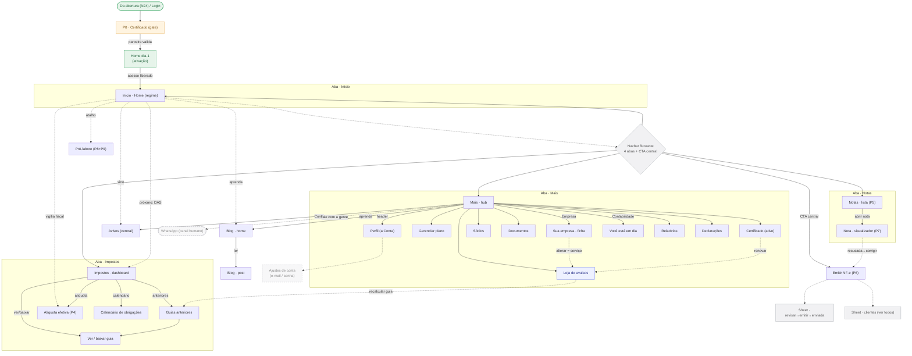

# 🗺️ Mapa vivo do portal (telas internas)

> **Nota GERADA. Não editar à mão.** A fonte-única é `portal/portal-data.mjs`; o diagrama, a tabela e o histórico são re-renderizados por `portal/gerar-mapa-portal.mjs`. É a irmã de [[mapa-flow-mermaid]] — aquela cobre a ENTRADA (N1–N24, funil linear até o pagamento); esta cobre a CASA (dia-2, o app navegável pós-abertura).
>
> **Como atualizar:** mude `portal/portal-data.mjs` → rode `node execucao/portal/gerar-mapa-portal.mjs`. Ele redesenha tudo, confere o drift contra as rotas reais de `(app)/(portal)` (ignorando as de laboratório) e, se algo estrutural mudou, grava um snapshot versionado em `portal/versoes/` + uma linha no histórico.
>
> **O portal NÃO é flow linear, é grafo de navegação:** 4 abas (Início · Impostos · Notas · Mais) + **CTA central Emitir NF-e**, cada aba com seus drill-downs. Autoridade das abas = `(app)/(portal)/layout.tsx`.
>
> **Legenda:** 🟢 validado/oficial · 🟡 espera gente · ⚪ só UX (revisado) · ✅ construída · 🚧 planejada. No diagrama: verde = entrada/home feliz · âmbar = gate/espera · azul = monetização (à-la-carte) · cinza = navbar/sheet (estrutural) · cinza tracejado = planejado/externo · losango = navbar/decisão · seta cheia = drill-down · seta tracejada = atalho/deep-link.

## 🖼️ Diagrama

<!-- PORTAL:MAPA:INI -->

<!-- PORTAL:MAPA:FIM -->

## ✅ Validação tela por tela

<!-- PORTAL:TABELA:INI -->
| # | Tela | Rota | Construída | Validado | Falta validar |
|---|---|---|:--:|:--:|---|
| 1 | P0 · Certificado (gate) | `/certificado` | ✅ | 🟡 | Certificadora PARCEIRA valida por videochamada (não upload); o gate destrava emitir NF-e + acesso à Receita. Enquanto pendente, o resto trava. |
| 2 | Home dia-1 · (ativação) | `/home-dia1` | ✅ | ⚪ | Confetti da marca no nascimento + trilha de ativação (1 de 3); certificado é etapa PASSIVA; SEM navbar até liberar acesso; download do Cartão CNPJ. |
| 3 | Início · Home (regime) | `/inicio` | ✅ | ⚪ | Home Campeã (montada em /mockup-home): saudação+CNPJ-pill, próximo compromisso, atalhos, notas recentes, aprenda, quem cuida, vigília preditiva. Número-guru fora. |
| 4 | Impostos · dashboard | `/impostos` | ✅ | 🟡 | Carrossel do mês (DAS+INSS) · vigília fiscal · guias anteriores clicáveis (status automático) · calendário. NÃO intermediamos pagamento. |
| 5 | Guias anteriores | `/impostos/guias` | ✅ | ⚪ | Mesma estrutura da lista de notas (busca+filtro+mês); status automático por param. |
| 6 | Alíquota efetiva (P4) | `/impostos/aliquotas` | ✅ | 🟡 | Alíquota efetiva + Fator R numa barra contra o corte dos 28% + 'número vivo' (tese North Star) + memória de cálculo. Fiscal → Larissa. |
| 7 | Ver / baixar guia | `/impostos/pagar` | ✅ | ⚪ | 'Pagar' virou VER/BAIXAR: documento + copiar código de barras + enviar. NÃO intermediamos pagamento; status-aware por param. |
| 8 | Calendário de obrigações | `/obrigacoes` | ✅ | ⚪ | Exploração mantida a pedido do Pedro (calendário). |
| 9 | Notas · lista (P5) | `/notas` | ✅ | ⚪ | Ledger: busca + filtro por status (escopado ao mês) + seletor de mês + exportar + alerta de recusadas + vazio. Card único (home↔P5). |
| 10 | Nota · visualizador (P7) | `/notas/detalhe` | ✅ | ⚪ | Status-aware (emitida/emitindo/recusada/cancelada) + documento em tela cheia + enviar por canal + corrigir-e-reemitir. |
| 11 | Emitir NF-e (P6) | `/emitir` | ✅ | 🟡 | Favorecido (bolhas por frequência, Consumidor final, Novo cliente) + valor (prévia viva do imposto) + serviço travado. Autofill por CNPJ (API pública); emissão NFS-e = RPA (não coberto). B2C = 'Consumidor final'. |
| 12 | Mais · hub | `/mais` | ✅ | ⚪ | Ordem por praticidade: Você→Perfil · plano · serviços à-la-carte · seções (Empresa/Contabilidade) · WhatsApp · Conta. |
| 13 | Perfil (a Conta) | `/perfil` | ✅ | ⚪ | Só a Conta (currículo/empresa migrou pro Mais) + lápis no avatar (trocar foto/logo). |
| 14 | Gerenciar plano | `/mais/plano` | ✅ | 🟡 | Preço FAKE (Mauro/custo). Próxima fatura com avulsos ADICIONADOS (modelo Contabilizei) · trocar pagamento (Pix) · cancelar (4 camadas, CDC art.49). |
| 15 | Loja de avulsos | `/mais/servicos` | ✅ | 🟡 | Camada à-la-carte (CND, declaração, alteração, reemissão). Preço+catálogo → Mauro. Avulso EFETIVO não-removível + double-check. |
| 16 | Sua empresa · ficha | `/mais/empresa` | ✅ | ⚪ | Ficha em blocos + copiar por dobra + copiar TUDO (formato WhatsApp) + CNPJ solto. Regra: página, não acordeon; honestidade antes do toque. |
| 17 | Sócios | `/mais/socios` | ✅ | ⚪ | — |
| 18 | Documentos | `/mais/documentos` | ✅ | ⚪ | — |
| 19 | Certificado (ativo) | `/mais/certificado` | ✅ | 🟡 | Estado ativo do certificado; emissão/renovação = certificadora parceira (transfer = upload). |
| 20 | Você está em dia | `/mais/em-dia` | ✅ | ⚪ | Painel de conformidade: hero escuro + streak + órgãos + cumprido-no-mês. |
| 21 | Relatórios | `/mais/relatorios` | ✅ | 🟡 | Anti-jargão: gráfico de faturamento + 'depois do imposto', honesto. Fiscal → Larissa. |
| 22 | Declarações | `/mais/declaracoes` | ✅ | 🟡 | PGDAS-D mensal · DEFIS anual, 'você não preenche nada'. Fiscal → Larissa. |
| 23 | Avisos (central) | `/avisos` | ✅ | ⚪ | Central de notificações (tipos com cor de estado, não-lido, marcar-lidas); sino no header da home + Mais>Conta. |
| 24 | Pró-labore (P8+P9) | `/pro-labore` | ✅ | 🟡 | Reusa a engine lib/fiscal (mesma do N18): estado atual + interativo (imposto + INSS ao vivo), mira 30%, aviso de borda. Fiscal → Larissa. |
| 25 | Blog · home | `/blog` | ✅ | ⚪ | Busca + chips de categoria + carrossel-herói + lista (ref. TripGlide). 'Aprenda com a gente' liga aqui. |
| 26 | Blog · post | `/blog/post` | ✅ | ⚪ | Leitura: imagem full-bleed sob o notch + folha arredondada + curtir + compartilhar + sugeridos. |
| 27 | Ajustes de conta · (e-mail / senha) | — | 🚧 | 🟡 | Settings menores da Conta; deferível (HOME §Agora). |
<!-- PORTAL:TABELA:FIM -->

## 🧭 A espinha (como se lê o mapa)
- **Entrada (seam):** vem da abertura (N24) ou do Login → **P0 Certificado** (gate: a certificadora **parceira** valida por videochamada, não upload) → **Home dia-1** (ativação, sem navbar) → quando o acesso libera, cai na **Home regime** (`/inicio`), e aí a navbar aparece.
- **Navbar flutuante:** 4 abas + o CTA central **Emitir NF-e**. É a única forma de trocar de seção; dentro de cada aba, o drill-down usa seta "voltar" (a barra some no detalhe).
- **As 4 abas:** **Início** (home) · **Impostos** (dashboard + guias + alíquota + calendário) · **Notas** (lista + visualizador) · **Mais** (hub: perfil, plano, loja de avulsos, Sua empresa, Contabilidade, conta, blog).

## 🔀 Cruzamentos que importam (não são hierarquia pura)
- **Sino / vigília / atalhos:** a Início é um átrio — o sino leva a Avisos, a vigília fiscal leva à Alíquota, e há atalho pro Pró-labore. São **deep-links**, não filhos da Início.
- **Honestidade antes do toque:** mudança cadastral/contratual (em Sua empresa, Certificado) **não** edita ali — deep-linka pra **Loja de avulsos** (é serviço pago). O mapa desenha isso com seta tracejada `alterar = serviço`.
- **Recalcular guia:** entra pela Loja → seleciona guia vencida → volta pra Guias/Pagar.
- **Corrigir nota recusada:** do visualizador (P7) volta pro **Emitir** pré-preenchido.

## ⚠️ Notas de fidelidade
- **Não intermediamos pagamento:** "Pagar" é **ver/baixar guia** + copiar código de barras. Decisão travada.
- **Emissão de NFS-e = RPA**, não coberta por API de órgão (ver [[infosimples-funcionalidades]]); o autofill por CNPJ é que usa a API pública.
- **Tudo é mockup/farol** (tsc+eslint limpos): "validado ⚪" = UI revisada; "🟡" = espera gente (Mauro preço/plano · Larissa fiscal · parceira certificado).
- **Laboratório fora do mapa de propósito:** `/componentes`, `/home-a…f`, `/home-campea`, `/inicio-ref*`, `/impostos-v1/v2`, `/mais-v1`, `/mais-completa` existem no código como exploração — o drift-check as ignora, não são telas canônicas.
- **O flow #2 (migração) não está aqui** — ele é entrada, vive no [[mapa-flow-mermaid]].

## 📜 Histórico de versões (commit interno)
> Cada linha = um estado estrutural do mapa. Snapshots completos em `portal/versoes/` (`.json` p/ diff + `.mmd` legível). Mais recente no topo.

<!-- PORTAL:VERSOES:INI -->
- **v1** · 2026-07-27 · versão inicial (32 nós, 41 conexões)
(o gerador preenche aqui)
<!-- PORTAL:VERSOES:FIM -->

## Links
[[mapa-flow-mermaid]] (a entrada, N1–N24) · [[matriz-portal-interno]] (P0–P14) · [[cruzamento-portal-interno]] (spec canônica) · [[backlog-telas-portal]] (as 19 telas) · [[design-system]] (arquétipos + shells) · [[legalize-portal-telas-construidas]] · [[HOME]]
