# 🧭 Pipeline de leads POR ETAPA (Board A reformulado — nossa parte, pré-certificado)

> **O que é:** a reformulação da coluna operacional do [[handoff-sistema-gestao-dev]] §3.1 / [[spec-kanban-leads]] §Board A. Só **a nossa parte** do CRM (leads NOSSOS: nossa · externa · usuário), do pagamento até o CNPJ sair — **antes** do pipeline do certificado (Board B / parceiro), que fica intacto.
>
> **Por que existe:** o modelo anterior separava as colunas por **DONO da pausa** (🟦 nossa · 🟨 externa · 🟧 usuário). Como o dono se alterna várias vezes ao longo da abertura, o card fica **indo e voltando entre as mesmas 3 colunas** — ping-pong. Pra quem opera, deixa de ser uma **linha do flow** e vira um vaivém confuso.
>
> **A virada (regra-mãe):** **a ETAPA (a pausa do flow, em ordem) vira a COLUNA; o DONO vira a COR/badge do card.** O mesmo dono pode aparecer em várias colunas — cada visita é uma etapa distinta, mais à frente. Assim o lead **só anda pra frente**, e a cor diz *"a bola está com quem agora"* sem precisar voltar de coluna.

Fonte do mapeamento: `produto/_flow/flow-data.mjs` (`produto/_flow/flow-data.mjs`, fonte-verdade) · [[mapa-ramificacoes-flow]] (as pausas) · [[fluxo-abertura-portais-pedro-dev]] (sequência dos órgãos, Izabela) · [[spec-kanban-leads]] · [[spec-dashboard-adm-metricas]] (o par métrico).

---

## 1. O problema, concreto

Trace do dono-da-pausa numa abertura típica (pós-pagamento), no modelo antigo:

```
🟧 paga boleto → 🟧 preenche dossiê → 🟦 revisamos o nome → 🟨 Junta analisa
   → 🟧 assina no GOV.BR → 🟨 registra + libera CNPJ
```

No board de 4 baldes isso é: **🟧 → 🟧 → 🟦 → 🟨 → 🟧 → 🟨**. O card **volta pra 🟧 duas vezes e pra 🟨 duas vezes**. Quem opera não lê "onde no processo esse lead está" — lê um card saltando entre as mesmas colunas. Pior: uma recusa de órgão mandava o card **de volta** de 🟨 → 🟦, reforçando o vaivém.

**Diagnóstico do Pedro (24/07):** mesmo que o lead passe por "externa" 2×, ele não pode ir pra outra coluna e **voltar** pra "externa" — tem que ser **duas etapas distintas, uma à frente da outra**. Colunas destrinchadas por etapa, linha sempre pra frente.

---

## 2. A linha (forward-only)

Cada pausa do flow = **uma coluna**, em ordem. A cor = o dono da bola naquela etapa. Mesmo dono repete como colunas diferentes (é o que o Pedro autorizou: "pode criar mais de um pipeline de externa/nossa/usuário").

```mermaid
flowchart LR
  PAG["💳 1 · Aguardando<br/>pagamento"] --> CAD["📝 2 · Preenchendo<br/>o cadastro"]
  CAD --> CONF["🔎 3 · Conferência<br/>pré-Junta"]
  CONF --> VIAB["🏛️ 4 · Viabilidade<br/>na Junta"]
  VIAB --> ASSIN["✍️ 5 · Assinatura<br/>do contrato"]
  ASSIN --> REG["🧾 6 · Registro<br/>+ CNPJ"]
  REG --> CERT["🔵 Handoff certificado<br/>(Board B, outro doc)"]

  classDef u fill:#FDE8D7,stroke:#E8853A,color:#7A3E10;
  classDef n fill:#DCE7FB,stroke:#3B6FD4,color:#1B3A78;
  classDef e fill:#FBF1D0,stroke:#C9A227,color:#6B5410;
  classDef c fill:#DDEBF6,stroke:#3E86C0,color:#1C4568;
  class PAG,CAD,ASSIN u;
  class CONF n;
  class VIAB,REG e;
  class CERT c;
```



Legenda de cor (o DONO, agora badge do card): 🟧 **usuário** (cutuca) · 🟦 **nossa** (age) · 🟨 **externa/órgão** (monitora) · 🔵 **certificado/parceiro** (Board B).

| # | Coluna | Dono (cor) | Flow (`produto/_flow/flow-data.mjs`) | Entra quando | Sai quando | Operador faz | Relógio / alerta |
|---|---|---|---|---|---|---|---|
| 1 | 💳 **Aguardando pagamento** | 🟧 usuário | N9 → P2 | boleto/Pix gerado | pagamento compensou | **cutuca** (dunning) | nudge `24→72h` *[chute]*. **Cartão pula** direto pra 2 |
| 2 | 📝 **Preenchendo o cadastro** | 🟧 usuário | N10–N19 | pagou | assinou o termo (N20) | **cutuca** se travar (P1 retomar) | nudge se parado; abandono = 🚨 |
| 3 | 🔎 **Conferência pré-Junta** | 🟦 nossa | entre N20 e N21 | cliente aceitou o termo irreversível | submetemos a viabilidade | **AGE**: revisa nome/dossiê, monta a viabilidade | **SLA nosso** — grita rápido `>24h` *[chute]* (aqui **nós** somos o gargalo) |
| 4 | 🏛️ **Viabilidade na Junta** | 🟨 externa | N21 | submetido à JUCEMG | viabilidade aprovada | **MONITORA** | `>N dias` *[chute]*; **🚨 recusa = flag in-place** (§4) |
| 5 | ✍️ **Assinatura do contrato** | 🟧 usuário | N22 (+N23) | contrato social pronto na JUCEMG | os sócios assinaram no GOV.BR | **cutuca**; se GOV.BR bronze, guia upgrade prata/ouro | nudge; **P3 consenso** do 2º sócio (B5) mora aqui |
| 6 | 🧾 **Registro + CNPJ** | 🟨 externa | N21 (cont.) → ATIVA | contrato assinado | CNPJ liberado (+ inscrições municipais) | **MONITORA** (o CRC assina/se responsabiliza na liberação — micro-ação 🟦, ver nota) | prazo BH serviço **~5 dias** (Izabela, [[fluxo-abertura-portais-pedro-dev]]); **🚨 exigência = flag in-place** |
| → | 🔵 **Handoff certificado** | Board B | ATIVA (seam) | CNPJ emitido | — | *(fora deste doc — [[spec-kanban-leads]] §Board B)* | — |

> **Nota da col. 6 (granularidade opcional):** a Fase 3 tem, no fim, **"liberação do CNPJ, onde o CRC assina/se responsabiliza"** — uma micro-ação **🟦 nossa** dentro de uma coluna 🟨. Deixei embutida pra não picar demais. Se a operação quiser rastrear o "CRC precisa assinar" como fila própria, é **trivial promover** a uma coluna 7 🟦 **Liberação do CNPJ** entre a 6 e o handoff — exatamente o tipo de "mais um pipeline de nossa" que o Pedro liberou. Decisão de granularidade, deixada aberta.

---

## 3. As 5 pausas do flow → as colunas (a prova de que a linha é o flow, não invenção)

O shell do app ([[design-system]] §0 / `(app)/layout.tsx`) já nomeia **5 pausas**. Elas caem 1:1 nas colunas — é o que garante que o board é a espinha do flow:

| Pausa nomeada | Onde | Vira a coluna |
|---|---|---|
| **P2** salvar boleto | N9 → P2 | 1 · Aguardando pagamento |
| **P1** salvar & retomar | qualquer ponto do dossiê | overlay/🚨 na col. 2 (abandono) |
| **P5** constituição (assíncrona, **multi-pausa por órgão**) | N21 | colunas 4 **e** 6 (é a pausa que se parte em duas etapas — a raiz do ping-pong antigo) |
| **P4** GOV.BR (assinatura) | N22 | 5 · Assinatura do contrato |
| **P3** consenso 2º sócio | N22 / B5 | dentro da col. 5 (os dois assinam) |

O insight central: **P5 é uma pausa só no papel, mas o órgão te para DUAS vezes** (viabilidade, depois registro+CNPJ), com uma ação do **cliente no meio** (assinar). No modelo dono-da-pausa isso vira 🟨→🟧→🟨 (vaivém). Aqui vira **col.4 → col.5 → col.6** (frente).

---

## 4. Regras (o que faz a linha andar só pra frente)

1. **Dono = cor, etapa = coluna.** A coluna nunca é "nossa/externa/usuário" — é a etapa do flow. A cor do card diz de quem é a bola. O mesmo dono aparece em colunas diferentes (🟧 nas 1,2,5 · 🟦 na 3 · 🟨 nas 4,6).
2. **Recusa / exigência = FLAG in-place, NUNCA volta de coluna.** Órgão reprovou nome (viabilidade) ou pediu exigência (registro): o card **fica na mesma coluna** com 🚨 + badge *"quem resolve"* (🟦 nós refazemos / 🟧 cliente corrige). Resolveu → segue pra frente na MESMA coluna. Nada de card pulando pra trás. *(É a diferença dura vs. o "🟨 → 🟦" do modelo antigo.)*
3. **Auto-feed:** o card cai na coluna **sozinho**, dirigido pelo estado real do lead (mesma tese do [[spec-kanban-leads]]: o operador não arrasta). Cada transição da §2 é um evento do stream ([[spec-dashboard-adm-metricas]] §telemetria) — **uma lista de eventos só** move o card E alimenta o funil.
4. **Cartão vs. boleto:** cartão nasce na col. 2 (já pagou); boleto/Pix nasce na col. 1. Nenhum outro fork muda a ordem das colunas.
5. **Multiplicar coluna do mesmo dono é permitido e esperado** — é o mecanismo que mata o ping-pong. Se aparecer uma 3ª pausa 🟨 (ex.: municipal separado do registro), vira **col. própria à frente**, não reuso da col. 4.

---

## 5. O que fica FORA (não muda)

- **Board B (certificado / parceiro)** — intacto ([[spec-kanban-leads]] §Board B). Nossa linha **termina no CNPJ emitido**; ali o card faz o seam pro 🔵 e dispara o "📥 Novo" do parceiro. O gate de validação e a **🟩 ATIVA** ficam **depois** do certificado, então estão além do escopo "nossa parte, antes do certificado".
- **Pré-pagamento** (gate/veredito/encaixe/dossiê antes de pagar) — é **self-service/funil do dashboard**, não board de ops. O lead só entra neste board ao **pagar**.
- **⬜ Saídas** (🟡 waitlist regulamentada · 🔴 comercial Mauro) — são **terminais do gate** (pré-pagamento, humano). Ficam numa **raia lateral**, fora da linha forward (não são etapa da abertura, são desvio de saída — [[mapa-ramificacoes-flow]] Tipo A).

---

## 6. Pendências / a confirmar

- **SLAs `[chute]`** das colunas 1–4 (só o `48h` do "Novo" do parceiro, no Board B, está travado). Validar na operação real.
- **Taxa JUCEMG (R$268,51 ME — o R$288 morreu, [[fiscal-simples-bh-2026]]):** paga pelo cliente. **Quando** é cobrada define se há uma micro-pausa 🟧 antes da col. 6 ou se entra no checkout inicial (N7). *A confirmar com o Mauro/fluxo de cobrança.*
- **Col. 7 opcional** (🟦 Liberação do CNPJ / CRC assina) — promover ou deixar embutida (§2 nota). Decisão de granularidade da operação.
- **Quem é o operador** do board (nosso / dev / escritório) — herdado do [[spec-kanban-leads]], ainda aberto.
- **Recusa com correção do cliente** — a col. 4/6 com flag 🟧 precisa de uma UI de "o que corrigir" no lado do cliente (liga no REC/`/painel/recusa` do flow). Dev.

## 🔗 Cruza com
[[spec-kanban-leads]] (o Board A que este doc reformula) · [[handoff-sistema-gestao-dev]] §3.1 · [[mapa-ramificacoes-flow]] (pausas + saídas) · `produto/_flow/flow-data.mjs` · [[fluxo-abertura-portais-pedro-dev]] (órgãos) · [[spec-dashboard-adm-metricas]] · [[HOME]].
