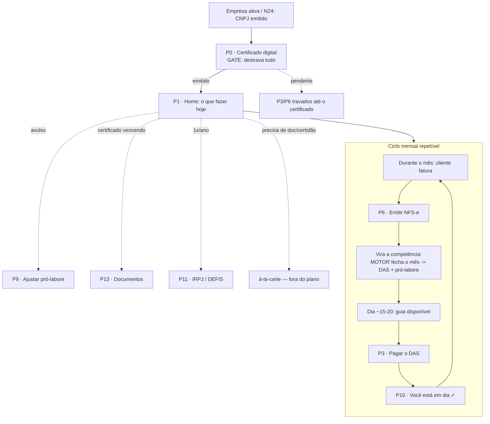

# 🧩 Matriz do Portal Interno (o "dia-2") — versão leve

> **O que é:** o mapa em papel do **portal pós-abertura** (o app logado, depois que a empresa está ativa). É o "dia-2" que o flow de abertura N1→N24 **ainda não constrói** — o **N24 é a porta** deste portal. Feito ANTES de desenhar tela, porque este portal é **cíclico** (não linear) e é uma **vitrine sobre o motor contábil**, então a ordem/dado importa mais que o pixel.
>
> **Escopo travado:** só o que é **grátis no plano Padrão R$195** da Contabilizei (cruzamento [[plano-padrao-195-referencia]] × [[2026-07-21-dossie-plataforma-logada|dossiê logado]]). Fora daqui = deferido/backlog.
>
> **Fonte do método:** mesma disciplina do [[mapa-flow-mermaid|mapa do flow de abertura]] (inventário + validação tela a tela), em versão enxuta.

## 🎯 Princípios (herdados do dossiê)
1. **1 foco por vez** — "o que fazer hoje", não a home-catálogo densa deles.
2. **Fechar os loops que eles deixam abertos** — o maior: **pagar o DAS pelo app**, não "confirme que pagou".
3. **Zero jargão** — DRE/DARF/competência/duplo-vínculo traduzidos; contábil cru fica atrás de "avançado".
4. **Certificado invisível** — resolvido nos bastidores (B4 já emite), o cliente nunca vê "emita na prefeitura".
5. **Sem vender pânico** — o oposto da máquina de medo (dunning) deles.

## 🔗 Legenda
**De onde vem o dado:** 🔧 Motor contábil (backend do dev) · ⚙️ Nossa engine fiscal (`lib/fiscal`, Fator R, N18) · 🏛️ Órgão/API (Serpro, prefeitura/NFS-e, AC certificado, Open Finance) · 📋 Cadastro (dado do onboarding).
**Validação:** 🟢 temos/decidido · 🟡 depende (dev/decisão/Larissa) · 🔴 travado (decisão aberta).

---

## ⚠️ As 3 dependências duras (ler antes)
Estas NÃO travam a matriz nem os mockups, mas travam virar **produto de verdade**:
1. **🔧 O motor contábil mensal existe?** — quem calcula o DAS, gera as declarações e fecha a competência é o backend do dev (o "IA diretor contábil" + robôs). O portal é uma **janela** sobre isso; sem o motor, as telas mostram mock, não dado real. → 🟡
2. **🏛️ Pagar o DAS pelo app** — nosso diferencial nº1. Emitir a guia a pesquisa fiscal resolveu (API Serpro); **pagar** é outra decisão (Open Finance / débito / PIX). Sem isso, caímos no "confirme que pagou" deles. → 🔴 decisão aberta.
3. **🏛️ Conciliação bancária (Open Finance)** — deliberadamente fora do mínimo; a Conta PJ deles é lock-in. → deferido.
4. **🤝 Certificado via PARCEIRO terceirizado (P0)** — **modelo decidido 22/07:** a emissão inteira (contato, agendamento, videochamada de validação de identidade) é executada **pelo parceiro, fora do nosso app**; nós só **transferimos** o cliente. Um **funcionário do parceiro** tem **acesso escopado** ao nosso sistema pra **fazer upload do certificado pronto** → a gente **valida e libera**. → 🟢 modelo travado (parceiro específico + a mecânica de acesso escopado = 🟡).

---

## 🔗 Espinha de dados: o flow de entrada semeia o portal (N→P)
O portal **não começa do zero** — é a **continuação** de uma espinha de dados que o flow de abertura (N1→N24) já coletou e validou. Todo número que o cliente vê no dia-2 foi semeado no dia-0.

| Dado gerado/validado na ENTRADA | Alimenta no PORTAL |
|---|---|
| **CNAE** validado (N4/N5) + **CNAE fiscalmente ótimo** (N18) | P4 alíquotas (Fator R · ISS · anexo) · P6 emitir nota (pré-preenche CNAE/serviço/LC116) · P8 pró-labore |
| **Sócios + duplo vínculo** (N10–N12) | P8/P9 pró-labore (nº de sócios · teto INSS) |
| **Empresa · natureza · nome** (N13–N16) | P12 dados da empresa |
| **Faixa de faturamento** | P1 calendário · P4 alíquotas · simulador |
| **Certificado** (B4 / P0) | P13 documentos · **destrava P6 e P3** |
| **Plano / pagamento** (N9) | mensalidade |
| **Dados do responsável** | **P0 validação de identidade do certificado** |

> **Vale nos DOIS sentidos (auditoria de graça):** montar esta espinha revela (a) se a entrada **deixou de coletar** algo que o portal precisa, e (b) se a entrada **pergunta** algo que o portal nunca usa. **A matriz do portal audita o flow de abertura** — quando cairmos nas telas, cada `📋 Cadastro` é uma amarra a conferir contra o N-flow.

---

## 🗺️ Inventário de telas (P0–P14)

> **Dois eixos:** o **Módulo** (abaixo) é a **navegação** (como o cliente acha a tela). O **Arquétipo** é o **shell de build** (como a gente reusa). As 15 telas colapsam em **6 arquétipos**, e **4 já têm shell pronto do flow de abertura** — o portal é recomposição, não invenção.

**Arquétipos (shells de build):**
| Arquétipo | O que é | Telas | Shell |
|---|---|---|---|
| **Gate** | pausa-com-status, aguarda processo externo | P0 · P10 | ✅ reusa `painel.tsx` + `StatusIcon` (B4/N21) |
| **Hub** | "o que fazer hoje", foco único | P1 | 🆕 novo (simples) |
| **Lista** | coleção filtrável por período + item→detalhe | P2 · P5 · P11 · P13 | 🆕 shell novo (1 vez, serve 4) |
| **Detalhe** | 1 objeto + status + 1 CTA forte / confirmação | P3 · P7 · P8 | 🟡 parcial novo |
| **Simulador** | mexe/expande e vê o número mudar | P4 · P9 | ✅ reusa N18 (`/simulador`) |
| **Form** | wizard / campos de leitura+edição | P6 · P12 · P14 | ✅ reusa `ui/form.tsx` + dropdown custom |

### Módulo 0 — Gate de entrada (o certificado destrava TUDO) ⭐
> **O 1º passo real do dia-2 NÃO é gerar a guia — é o certificado digital.** O dossiê confirma: é pré-requisito pra emitir nota **e** pra acessar os serviços da Receita. Sem ele, a gente não consegue fazer **nada** pela pessoa (nota, DAS/e-CAC, procuração pro contador). É a **chave universal** do portal → **o ciclo mensal não começa antes dele.**

| Tela | Arquétipo | Mostra | Dado | Ações | Validação |
|---|---|---|---|---|---|
| **P0 · Certificado digital** ⭐ | **Gate** ✅ | o gate que destrava tudo. **Emissão é 100% do PARCEIRO, fora do nosso app** (contato, agendamento, videochamada de identidade). **Estados na ótica do app:** pendente → **transferido ao parceiro** (o cliente faz a videochamada COM eles) → **certificado recebido** (operador do parceiro fez upload) → **validado** (destrava P3/P6) | 🤝 parceiro (executa a emissão) · 👤 operador do parceiro (upload no nosso sistema) · 📋 dados do responsável | transferir ao parceiro · receber upload · validar | 🟢 modelo travado 22/07 (parceiro específico 🟡) |

> ✅ **RESOLVIDO 22/07 — nem bastidor silencioso, nem tela nossa de videochamada.** A validação de identidade (videochamada) acontece **com o PARCEIRO terceirizado**, fora do nosso app. A gente **transfere** o cliente e recebe de volta o certificado. Isso reconcilia o conflito spec × matriz: no NOSSO app, P0 é **status + handoff + validação do upload** — não uma videoconf embutida, nem um simples ✓ invisível.
>
> **👤 Acesso do parceiro (operador externo) — requisito novo:** um funcionário do parceiro precisa de **login escopado** no nosso sistema, restrito a: (a) ver os clientes atribuídos aguardando certificado; (b) **fazer upload** dos documentos do certificado; (c) nada além disso. **Trava de segurança (LGPD, cf. dev isola certificado em banco separado):** escopo mínimo · só o cliente atribuído · log de auditoria de cada upload · zero acesso a dado fiscal/financeiro do cliente. ⚠️ **quando formos CONSTRUIR esse acesso, carregar a skill `seguranca-de-sistema`** (é autorização + acesso externo a dado sensível). Provider específico + mecânica de atribuição = 🟡 a definir.

### Módulo A — Home ("o que fazer hoje")
| Tela | Arquétipo | Mostra | Dado | Ações | Validação |
|---|---|---|---|---|---|
| **P1 · Painel do dia** | **Hub** 🆕 | 1 foco (a próxima obrigação) + selo "em dia ✓" + atalhos (emitir nota · ver imposto · pró-labore). **Estados:** em-dia / guia-a-pagar / sem-nota-no-mês / pendência | 🔧 calendário+guia · ⚙️ status | ir pra P3/P6/P8 | 🟡 (calendário vem do motor) |

### Módulo B — Impostos
| Tela | Arquétipo | Mostra | Dado | Ações | Validação |
|---|---|---|---|---|---|
| **P2 · Meus impostos** | **Lista** 🆕 | lista de guias por competência (imposto · competência · vencimento · valor · status) + histórico | 🔧 motor calcula | abrir P3 · ver histórico | 🟡 |
| **P3 · Pagar o DAS** ⭐ | **Detalhe** 🟡 | o número + vencimento + **"pagar agora"** (o gap nº1). **Estados:** a-vencer / vence-hoje / pago / atrasado | 🔧 valor · 🏛️ execução | **pagar** · baixar guia | 🔴 (pagamento não fechado) |
| **P4 · Minhas alíquotas** | **Simulador** ✅ | composição sem jargão (total % · ISS · Fator R/folha %) — educativo | ⚙️ engine · 📋 CNAE | expandir memória de cálculo | 🟢 temos |
| *(Simulador)* | **Simulador** ✅ | forward: "e se eu faturar X?" — **já existe** `/simulador` (N18) | ⚙️ engine | — | 🟢 |

### Módulo C — Notas
| Tela | Arquétipo | Mostra | Dado | Ações | Validação |
|---|---|---|---|---|---|
| **P5 · Minhas notas** | **Lista** ✅ | lista/consulta por período + **empty state que convida** ("emita a 1ª, a gente guia") | 🏛️ registro NFS-e | abrir P6 | 🟡 |
| **P6 · Emitir NFS-e** ⭐ | **Form** ✅ | wizard **enxuto**: valor + cliente; CNAE/serviço (LC116/municipal) **pré-preenchidos do cadastro** (eles pedem 3 códigos crus) | 📋 pré-preenche · 🏛️ emissão | emitir | 🟡 (integração NFS-e dev/Izabela) · N24 = 1ª guiada |
| **P7 · Nota emitida** | **Detalhe** ✅ | confirmação + PDF/link | 🏛️ | baixar · replicar | 🟢 |

### Módulo D — Pró-labore (o diferencial-âncora)
| Tela | Arquétipo | Mostra | Dado | Ações | Validação |
|---|---|---|---|---|---|
| **P8 · Meu pró-labore** | **Detalhe** 🟡 | valor atual + **Fator R vivo** + "está otimizado" (sem o preset cru deles) | ⚙️ engine | abrir P9 | 🟢 |
| **P9 · Ajustar pró-labore** ⭐ | **Simulador** ✅ | **o N18 interativo**: mexe no valor e vê o imposto mudar na hora, com o "encostado na borda". Ensina o que eles escondem atrás de "confie na gente" | ⚙️ engine | salvar novo valor | 🟢 mecânica já existe |

### Módulo E — Está em dia / Relatórios
| Tela | Arquétipo | Mostra | Dado | Ações | Validação |
|---|---|---|---|---|---|
| **P10 · Você está em dia ✓** | **Gate** ✅ | prova de compliance humana: declarações entregues, sem despejar DRE | 🔧 motor gera/entrega | — | 🟡 |
| **P11 · Relatórios contábeis (avançado)** | **Lista** ✅ | DRE · Balanço · Balancete · Razão · Diário · Declarações — atrás de "avançado", **1 linha traduzindo cada**. Anual: IRPJ/DEFIS | 🔧 motor gera PDFs | baixar | 🟡 |

### Módulo F — Config / dados / documentos
| Tela | Arquétipo | Mostra | Dado | Ações | Validação |
|---|---|---|---|---|---|
| **P12 · Dados da empresa** | **Form** ✅ | CNPJ · regime · inscrição · endereço | 📋 cadastro | — | 🟢 |
| **P13 · Documentos** | **Lista** ✅ | contrato · docs assinados · **certificado (validade)** | 🔧 docs · 🏛️ certificado | baixar · renovar cert. | 🟢/🟡 |
| **P14 · Minha conta** | **Form** ✅ | e-mail · senha · telefone · multi-usuário · sair | 📋 | alterar · cadastrar usuário | 🟢 |

---

## 🔁 O ciclo mensal (a espinha do portal)
Ao contrário do flow de abertura (linear, N1→N24), o portal **repete todo mês**:

**Leitura:** **P0 (certificado) é o portão** — nada roda antes dele. Passado o portão, o **motor do dev é o coração do loop** (fecha a competência → gera guia + declarações), e o portal é a **face** desse loop pro cliente. Os 3 pontos onde a gente ganha ou empata — **P0 (o gate bem-feito), P3 (pagar) e P9 (pró-labore interativo)** — são os ⭐.

## 🚪 1º acesso / empty states
O CNPJ novo chega com **tudo zerado** — o momento mais frágil e onde o líder tem "empty state morto" ("nenhuma nota"). Nosso 1º acesso deve:
- **P0 é o 1º foco, não a nota:** "vamos fazer seu certificado — é o passo que destrava tudo". Até ele ficar pronto, o portal inteiro é sobre isso; P3/P6 aparecem travados **com o motivo claro** (não morto).
- **Depois do certificado**, P1 diz o próximo passo real ("emita sua 1ª nota" ou "nada a fazer, você está em dia").
- **P5/P6** convidam pra 1ª nota com o **N24** guiando.
- **P10** nasce "em dia ✓" (empresa recém-aberta não deve nada ainda) — tranquiliza.

## 🚫 Fora do escopo (deferido / backlog)
- **Conta PJ / conciliação bancária** (Open Finance) — não viramos banco.
- **Folha de pagamento** — funcionário fora do MVP (Karla).
- **Benefícios / Plano de Saúde** — upsell.
- **Catálogo à-la-carte** (~45 serviços) — decisão de plano com o Mauro (o que a gente inclui grátis pra sangrar eles: CND, declaração de faturamento, AIDF); ver [[plano-padrao-195-referencia]] §à-la-carte.

## 🧱 Ordem de construção recomendada (quando formos pras telas)
Pela **narrativa do dia-2** (o gate primeiro) + pelos 🟢 que não dependem do motor:
1. **P0 Certificado (gate) + P1 Home enxuta** — a entrada do portal; é o que o cliente vê 1º. Mockável já (o provider é 🟡, mas a tela e os estados se desenham).
2. **P8/P9 Pró-labore** — 100% nossa engine, é o diferencial-âncora, sai redondo já.
3. **P4 Minhas alíquotas** — nossa engine.
4. **P2/P3 Impostos** — telas prontas; o P3-pagar fica com o CTA e o back-end de pagamento como 🔴 aberto.
5. **P5/P6/P7 Notas** — reaproveita o N24.
6. **P10/P11 Está em dia** · **P12/P13/P14 Config** — dependem do motor pro dado real, mas as telas se desenham.

## 🔗 Links
- [[plano-padrao-195-referencia]] · [[2026-07-21-dossie-plataforma-logada]] · [[mapa-flow-mermaid]] · [[cnae-fiscalmente-otimo]] · [[HOME]]
