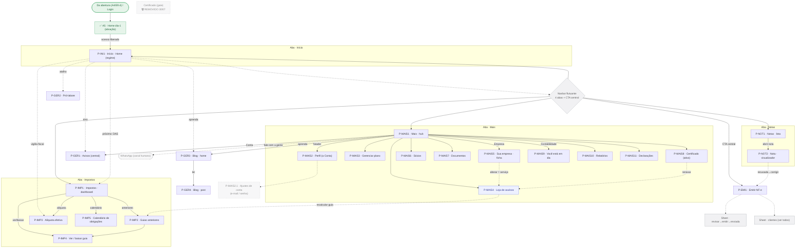

# 🗺️ Mapa vivo do portal (telas internas)

> **Nota GERADA. Não editar à mão.** A fonte-única é `portal/portal-data.mjs`; o diagrama, a tabela e o histórico são re-renderizados por `portal/gerar-mapa-portal.mjs`. É a irmã de [[mapa-flow-mermaid]] — aquela cobre a ENTRADA (N1–N24, funil linear até o pagamento); esta cobre a CASA (dia-2, o app navegável pós-abertura).
>
> **Como atualizar:** mude `portal/portal-data.mjs` → rode `node produto/me/viver/portal/gerar-mapa-portal.mjs`. Ele redesenha tudo, confere o drift contra as rotas reais de `(app)/(portal)` (ignorando as de laboratório) e, se algo estrutural mudou, grava um snapshot versionado em `portal/versoes/` + uma linha no histórico.
>
> **O portal NÃO é flow linear, é grafo de navegação:** 4 abas (Início · Impostos · Notas · Mais) + **CTA central Emitir NF-e**, cada aba com seus drill-downs. Autoridade das abas = `(app)/(portal)/layout.tsx`.
>
> **Legenda:** 🟢 validado/oficial · 🟡 espera gente · ⚪ só UX (revisado) · ✅ construída · 🚧 planejada. No diagrama: verde = entrada/home feliz · âmbar = gate/espera · azul = monetização (à-la-carte) · cinza = navbar/sheet (estrutural) · cinza tracejado = planejado/externo · losango = navbar/decisão · seta cheia = drill-down · seta tracejada = atalho/deep-link.

## 🖼️ Diagrama

<!-- PORTAL:MAPA:INI -->

<!-- PORTAL:MAPA:FIM -->

## ✅ Validação tela por tela

<!-- PORTAL:TABELA:INI -->
> ⚠️ **Drift detectado:** rota /mais/colaborador existe mas não está no mapa

| # | Tela | Rota | Construída | Validado | Falta validar |
|---|---|---|:--:|:--:|---|
| 1 | ✅ A5 · Home dia-1 · (ativação) | `/home-dia1` | ✅ | 🟢 | 🔓 SWAP validado 30/07: substitui a 'empresa ativa' antiga, sem confete nem selo coral no hero. Trilha de ativação (1 de 3) trata o certificado como item PASSIVO da própria trilha, não gate isolado. SEM navbar até liberar acesso; download do Cartão CNPJ. Mesma tela do A5 em flow-data.mjs (handoff Aprovação→Portal). |
| 2 | Certificado (gate) · 🗑️ REMOVIDO 30/07 | — | 🚧 | 🟢 | Era P0 antes do swap de 29/07, virou rota morta (nada navegava mais até aqui). Arquivo `/certificado` e a view apagados de vez 30/07, confirmado pelo Pedro. Fica só como marca histórica no mapa. |
| 3 | P-INI1 · Início · Home (regime) | `/inicio` | ✅ | ⚪ | Home Campeã (montada em /mockup-home): saudação+CNPJ-pill, próximo compromisso, atalhos, notas recentes, aprenda, quem cuida, vigília preditiva. Número-guru fora. |
| 4 | P-IMP1 · Impostos · dashboard | `/impostos` | ✅ | 🟡 | Carrossel do mês (DAS+INSS) · vigília fiscal · guias anteriores clicáveis (status automático) · calendário. NÃO intermediamos pagamento. |
| 5 | P-IMP2 · Guias anteriores | `/impostos/guias` | ✅ | ⚪ | Mesma estrutura da lista de notas (busca+filtro+mês); status automático por param. |
| 6 | P-IMP3 · Alíquota efetiva | `/impostos/aliquotas` | ✅ | 🟡 | Alíquota efetiva + Fator R numa barra contra o corte dos 28% + 'número vivo' (tese North Star) + memória de cálculo. Fiscal → Larissa. |
| 7 | P-IMP4 · Ver / baixar guia | `/impostos/pagar` | ✅ | ⚪ | 'Pagar' virou VER/BAIXAR: documento + copiar código de barras + enviar. NÃO intermediamos pagamento; status-aware por param. |
| 8 | P-IMP5 · Calendário de obrigações | `/obrigacoes` | ✅ | ⚪ | Exploração mantida a pedido do Pedro (calendário). |
| 9 | P-NOT1 · Notas · lista | `/notas` | ✅ | ⚪ | Ledger: busca + filtro por status (escopado ao mês) + seletor de mês + exportar + alerta de recusadas + vazio. Card único (home↔P-NOT1). |
| 10 | P-NOT2 · Nota · visualizador | `/notas/detalhe` | ✅ | ⚪ | Status-aware (emitida/emitindo/recusada/cancelada) + documento em tela cheia + enviar por canal + corrigir-e-reemitir. |
| 11 | P-EMI1 · Emitir NF-e | `/emitir` | ✅ | 🟡 | Favorecido (bolhas por frequência, Consumidor final, Novo cliente) + valor (prévia viva do imposto) + serviço travado. Autofill por CNPJ (API pública); emissão NFS-e = RPA (não coberto). B2C = 'Consumidor final'. |
| 12 | P-MAIS1 · Mais · hub | `/mais` | ✅ | ⚪ | Ordem por praticidade: Você→Perfil · plano · serviços à-la-carte · seções (Empresa/Contabilidade) · WhatsApp · Conta. |
| 13 | P-MAIS2 · Perfil (a Conta) | `/perfil` | ✅ | ⚪ | Só a Conta (currículo/empresa migrou pro Mais) + lápis no avatar (trocar foto/logo). |
| 14 | P-MAIS3 · Gerenciar plano | `/mais/plano` | ✅ | 🟡 | Preço FAKE (Mauro/custo). Próxima fatura com avulsos ADICIONADOS (modelo Contabilizei) · trocar pagamento (Pix) · cancelar (4 camadas, CDC art.49). |
| 15 | P-MAIS4 · Loja de avulsos | `/mais/servicos` | ✅ | 🟡 | Camada à-la-carte (CND, declaração, alteração, reemissão). Preço+catálogo → Mauro. Avulso EFETIVO não-removível + double-check. |
| 16 | P-MAIS5 · Sua empresa · ficha | `/mais/empresa` | ✅ | ⚪ | Ficha em blocos + copiar por dobra + copiar TUDO (formato WhatsApp) + CNPJ solto. Regra: página, não acordeon; honestidade antes do toque. |
| 17 | P-MAIS6 · Sócios | `/mais/socios` | ✅ | ⚪ | — |
| 18 | P-MAIS7 · Documentos | `/mais/documentos` | ✅ | ⚪ | — |
| 19 | P-MAIS8 · Certificado (ativo) | `/mais/certificado` | ✅ | 🟡 | Estado ativo do certificado; emissão/renovação = certificadora parceira (transfer = upload). |
| 20 | P-MAIS9 · Você está em dia | `/mais/em-dia` | ✅ | ⚪ | Painel de conformidade: hero escuro + streak + órgãos + cumprido-no-mês. |
| 21 | P-MAIS10 · Relatórios | `/mais/relatorios` | ✅ | 🟡 | Anti-jargão: gráfico de faturamento + 'depois do imposto', honesto. Fiscal → Larissa. |
| 22 | P-MAIS11 · Declarações | `/mais/declaracoes` | ✅ | 🟡 | PGDAS-D mensal · DEFIS anual, 'você não preenche nada'. Fiscal → Larissa. |
| 23 | P-GER1 · Avisos (central) | `/avisos` | ✅ | ⚪ | Central de notificações (tipos com cor de estado, não-lido, marcar-lidas); sino no header da home + Mais>Conta. |
| 24 | P-GER2 · Pró-labore | `/pro-labore` | ✅ | 🟡 | Reusa a engine lib/fiscal (mesma do C-flow): estado atual + interativo (imposto + INSS ao vivo), mira 30%, aviso de borda. Fiscal → Larissa. |
| 25 | P-GER3 · Blog · home | `/blog` | ✅ | ⚪ | Busca + chips de categoria + carrossel-herói + lista (ref. TripGlide). 'Aprenda com a gente' liga aqui. |
| 26 | P-GER4 · Blog · post | `/blog/post` | ✅ | ⚪ | Leitura: imagem full-bleed sob o notch + folha arredondada + curtir + compartilhar + sugeridos. |
| 27 | P-MAIS2.1 · Ajustes de conta · (e-mail / senha) | — | 🚧 | 🟡 | Settings menores da Conta; deferível (HOME §Agora). |
<!-- PORTAL:TABELA:FIM -->

## 🧭 A espinha (como se lê o mapa)
- **Entrada (seam):** vem da abertura (N24) ou do Login → **P0 Certificado** (gate: a certificadora **parceira** valida por videochamada, não upload) → **Home dia-1** (ativação, sem navbar) → quando o acesso libera, cai na **Home regime** (`/inicio`), e aí a navbar aparece.
- **Navbar flutuante:** 4 abas + o CTA central **Emitir NF-e**. É a única forma de trocar de seção; dentro de cada aba, o drill-down usa seta "voltar" (a barra some no detalhe).
- **As 4 abas:** **Início** (home) · **Impostos** (dashboard + guias + alíquota + calendário) · **Notas** (lista + visualizador) · **Mais** (hub: perfil, plano, loja de avulsos, Sua empresa, Contabilidade, conta, blog).

## 🔀 Cruzamentos que importam (não são hierarquia pura)
- **Sino / vigília / atalhos:** a Início é um átrio — o sino leva a Avisos, a vigília fiscal leva à Alíquota, e há atalho pro Pró-labore. São **deep-links**, não filhos da Início.
- **Honestidade antes do toque:** mudança cadastral/contratual (em Sua empresa, Certificado) **não** edita ali — deep-linka pra **Loja de avulsos** (é serviço pago). O mapa desenha isso com seta tracejada `alterar = serviço`.
- **Recalcular guia:** entra pela Loja → seleciona guia vencida → volta pra Guias/Pagar.
- **Corrigir nota recusada:** do visualizador (P7) volta pro **Emitir** pré-preenchido.

## ⚠️ Notas de fidelidade
- **Não intermediamos pagamento:** "Pagar" é **ver/baixar guia** + copiar código de barras. Decisão travada.
- **Emissão de NFS-e = RPA**, não coberta por API de órgão (ver [[infosimples-funcionalidades]]); o autofill por CNPJ é que usa a API pública.
- **Tudo é mockup/farol** (tsc+eslint limpos): "validado ⚪" = UI revisada; "🟡" = espera gente (Mauro preço/plano · Larissa fiscal · parceira certificado).
- **Laboratório fora do mapa de propósito:** `/componentes`, `/home-a…f`, `/home-campea`, `/inicio-ref*`, `/impostos-v1/v2`, `/mais-v1`, `/mais-completa` existem no código como exploração — o drift-check as ignora, não são telas canônicas.
- **O flow #2 (migração) não está aqui** — ele é entrada, vive no [[mapa-flow-mermaid]].

## 📜 Histórico de versões (commit interno)
> Cada linha = um estado estrutural do mapa. Snapshots completos em `portal/versoes/` (`.json` p/ diff + `.mmd` legível). Mais recente no topo.

<!-- PORTAL:VERSOES:INI -->
- **v4** · 2026-08-03 · renomeou ENTRY "Da abertura (N22/M6) / Login"→"Da abertura (A4/E9.4) / Login"; DIA1 "✅ P0 · Home dia-1 (ativação)"→"✅ A5 · Home dia-1 (ativação)"; INICIO "Início · Home (regime)"→"P-INI1 · Início · Home (regime)"; IMPOSTOS "Impostos · dashboard"→"P-IMP1 · Impostos · dashboard"; GUIAS "Guias anteriores"→"P-IMP2 · Guias anteriores"; ALIQ "Alíquota efetiva (P4)"→"P-IMP3 · Alíquota efetiva"; PAGAR "Ver / baixar guia"→"P-IMP4 · Ver / baixar guia"; OBRIG "Calendário de obrigações"→"P-IMP5 · Calendário de obrigações"; NOTAS "Notas · lista (P5)"→"P-NOT1 · Notas · lista"; NOTADET "Nota · visualizador (P7)"→"P-NOT2 · Nota · visualizador"; EMITIR "Emitir NF-e (P6)"→"P-EMI1 · Emitir NF-e"; MAIS "Mais · hub"→"P-MAIS1 · Mais · hub"; PERFIL "Perfil (a Conta)"→"P-MAIS2 · Perfil (a Conta)"; PLANO "Gerenciar plano"→"P-MAIS3 · Gerenciar plano"; SERVICOS "Loja de avulsos"→"P-MAIS4 · Loja de avulsos"; EMPRESA "Sua empresa · ficha"→"P-MAIS5 · Sua empresa · ficha"; SOCIOS "Sócios"→"P-MAIS6 · Sócios"; DOCS "Documentos"→"P-MAIS7 · Documentos"; CERTM "Certificado (ativo)"→"P-MAIS8 · Certificado (ativo)"; EMDIA "Você está em dia"→"P-MAIS9 · Você está em dia"; RELAT "Relatórios"→"P-MAIS10 · Relatórios"; DECLAR "Declarações"→"P-MAIS11 · Declarações"; AVISOS "Avisos (central)"→"P-GER1 · Avisos (central)"; PROLAB "Pró-labore (P8+P9)"→"P-GER2 · Pró-labore"; BLOG "Blog · home"→"P-GER3 · Blog · home"; BLOGPOST "Blog · post"→"P-GER4 · Blog · post"; CONTASET "Ajustes de conta (e-mail / senha)"→"P-MAIS2.1 · Ajustes de conta (e-mail / senha)" · falta-validar em ENTRY,DIA1,NOTAS,PROLAB
- **v3** · 2026-07-30 · renomeou CERT "Certificado (gate) ⚠️ ÓRFÃO"→"Certificado (gate) 🗑️ REMOVIDO 30/07" · status CERT construida→planejada · validação CERT pendente→oficial · falta-validar em CERT
- **v2** · 2026-07-30 · renomeou ENTRY "Da abertura (N24) / Login"→"Da abertura (N22/M6) / Login"; DIA1 "Home dia-1 (ativação)"→"✅ P0 · Home dia-1 (ativação)"; CERT "P0 · Certificado (gate)"→"Certificado (gate) ⚠️ ÓRFÃO" · validação DIA1 ux→oficial · falta-validar em ENTRY,DIA1,CERT · +conexões ENTRY→DIA1 · -conexões ENTRY→CERT,CERT→DIA1
- **v1** · 2026-07-27 · versão inicial (32 nós, 41 conexões)
(o gerador preenche aqui)
<!-- PORTAL:VERSOES:FIM -->

## Links
[[mapa-flow-mermaid]] (a entrada, N1–N24) · [[matriz-portal-interno]] (P0–P14) · [[cruzamento-portal-interno]] (spec canônica) · [[backlog-telas-portal]] (as 19 telas) · [[design-system]] (arquétipos + shells) · [[legalize-portal-telas-construidas]] · [[HOME]]
